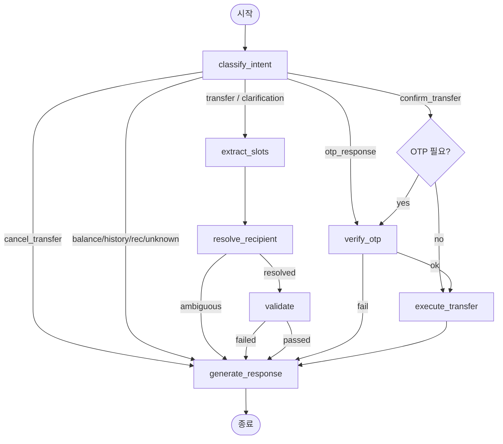

# Prebuilt Banking AI Transfer Agent

내부 재사용 가능한 은행 이체 AI 에이전트 데모입니다.
으뜸은행 차세대 뱅킹 프로젝트에 **사전 제작(prebuilt) 에셋**으로 임포트할 수 있도록 설계되었습니다.

---

## 목업 데이터 구조

앱 최초 실행 시 `seed.py`가 자동으로 SQLite DB에 데모 데이터를 생성합니다.
아래 구조를 먼저 파악하면 데모 시나리오와 에이전트 동작을 이해하기 훨씬 쉽습니다.

### 데모 사용자

| 항목 | 값 |
|------|----|
| 이름 | 이병민 |
| 로그인 ID | kimcs |
| 1회 이체 한도 | 10,000,000원 |
| 일일 이체 한도 | 30,000,000원 |

### 계좌

| 계좌명 | 은행 | 계좌번호 | 잔액 | 비고 |
|--------|------|----------|------|------|
| 주계좌 | 으뜸은행 | 024-01-0123456 | 8,250,000원 | 기본 출금 계좌 |
| 저축계좌 | 으뜸은행 | 024-02-0654321 | 5,250,000원 | |

주계좌 잔액은 **일반 이체(소액)**, **잔액 부족 시나리오(9백만 이상 시도)**, **OTP 시나리오(3백만 이상)** 를 모두 커버할 수 있도록 설정되어 있습니다.

### 수신자 및 즐겨찾기

에이전트가 "엄마", "민수" 같은 별칭으로 수신자를 찾는 기반 데이터입니다.

| 별칭 | 실명 | 은행 | 이체 횟수 | 마지막 이체 | 비고 |
|------|------|------|-----------|-------------|------|
| 엄마 | 이순자 | 한빛은행 | 12회 | 5일 전 | |
| 아빠 | 김영수 | 나라은행 | 8회 | 20일 전 | |
| 민수 | 박민수 | 새벽은행 | 5회 | 10일 전 | **모호성 시나리오용** |
| 민수 | 이민수 | 구름뱅크 | 3회 | 15일 전 | **모호성 시나리오용** |
| 집주인 | 장태호 | 하늘은행 | 12회 | 2일 전 | |
| 관리사무소 | 관리사무소 | 으뜸은행 | 12회 | 2일 전 | |
| 지연 | 박지연 | 바람뱅크 | 6회 | 30일 전 | |
| 동생 | 이서준 | 들판은행 | 4회 | 45일 전 | |
| 적금 | 미래적금 | 으뜸은행 | 12회 | 3일 전 | |

> **"민수" 중복 설계 의도**: 별칭이 동일한 수신자가 2명 등록되어 있어, "민수한테 5만원 보내줘" 입력 시 에이전트가 후보 목록을 제시하고 사용자에게 선택을 요청하는 **모호성 해소(clarification)** 플로우를 시연합니다.

### 정기이체

| 별칭 | 수신자 | 금액 | 매월 |
|------|--------|------|------|
| 월세 | 장태호 (집주인) | 550,000원 | 10일 |
| 관리비 | 관리사무소 | 80,000원 | 25일 |
| 용돈 | 이순자 (엄마) | 200,000원 | 1일 |
| 적금 | 미래적금 | 500,000원 | 5일 |

"월세 보내야 하지?" 입력 시 에이전트가 정기이체 데이터를 참조하여 자동으로 금액과 수신자를 채워 확인 카드를 제시합니다.

### 이체 내역 (최근 40일)

에이전트의 "지난번처럼 보내줘" 추천 및 이체내역 조회 시나리오에 사용됩니다.

| 수신자 | 금액 | 메모 | 시점 |
|--------|------|------|------|
| 장태호 | 550,000원 | 4월 월세 | 2일 전 |
| 이순자 | 200,000원 | 엄마 용돈 | 3일 전 |
| 미래적금 | 500,000원 | 자유적금 | 5일 전 |
| 관리사무소 | 80,000원 | 4월 관리비 | 7일 전 |
| 박지연 | 50,000원 | 밥값 더치페이 | 10일 전 |
| 이순자 | 100,000원 | 생일 용돈 | 15일 전 |
| 김영수 | 300,000원 | 아버지 병원비 | 20일 전 |
| 박민수 | 30,000원 | 커피값 | 25일 전 |
| 이서준 | 150,000원 | 동생 교통비 | 30일 전 |
| 장태호 | 550,000원 | 3월 월세 | 33일 전 |
| 이순자 | 200,000원 | 3월 엄마 용돈 | 33일 전 |
| 박지연 | 70,000원 | 축의금 | 40일 전 |

### 수수료 정책

| 조건 | 수수료 |
|------|--------|
| 같은 은행 (으뜸은행 → 으뜸은행) | 0원 |
| 타행 이체 | 500원 |
| OTP 요청 기준 | 1회 이체 3,000,000원 이상 |

---

## 아키텍처 원칙: LLM은 이해만, 결정은 코드가

이 시스템에서 LLM은 **자연어 이해**만 담당합니다.

| 역할 | 담당자 |
|------|--------|
| 의도(intent) 분류 | LLM 또는 결정론적 파서 |
| 슬롯(recipient, amount 등) 추출 | LLM 또는 결정론적 파서 |
| 수신자 해석 / 추천 순위 | 결정론적 Python 로직 |
| 잔액 확인 | 결정론적 Python 로직 |
| 한도 검증 | 결정론적 Python 로직 |
| 이체 실행 | 결정론적 Python → SQLite 트랜잭션 |
| 감사 로그 | 결정론적 Python 로직 |

LLM이 실제 이체 여부를 결정하지 않습니다. 이는 금융 규정 준수(컴플라이언스), 예측 가능성, 감사 추적성을 보장하기 위한 설계 원칙입니다.

---

## 빠른 시작

### 1. 의존성 설치

```bash
cd ai-banking-transfer-agent
python -m venv .venv
source .venv/bin/activate        # Windows: .venv\Scripts\activate
pip install -r requirements.txt
```

### 2. 환경 변수 설정 (선택)

```bash
cp .env.example .env
# .env를 열어 필요한 값 수정 (기본값으로도 실행 가능)
```

### 3. 앱 실행

```bash
python app.py
```

또는

```bash
flask --app app run
```

첫 실행 시 자동으로 SQLite DB를 생성하고 데모 데이터를 시드합니다.

브라우저에서 `http://localhost:5000` 접속.

### 4. 시드 데이터 재생성

```bash
python seed.py
```

또는 앱 UI에서 **"데모 데이터 초기화"** 버튼을 누르세요.

---

## LLM 모드 활성화 (선택)

기본 모드는 **LLM 없이** 작동합니다. 키가 없어도 모든 기능이 동작합니다.

LLM을 사용하려면 `.env`에서 설정:

```bash
# OpenAI
LLM_PROVIDER=openai
OPENAI_API_KEY=sk-...
# pip install langchain-openai

# Anthropic
LLM_PROVIDER=anthropic
ANTHROPIC_API_KEY=sk-ant-...
# pip install langchain-anthropic
```

---

## 페이지 설명

| 페이지 | URL | 설명 |
|--------|-----|------|
| 채팅 | `/chat` | 한국어 대화형 이체 인터페이스 |
| 계좌/잔액 | `/accounts` | 계좌 목록, 잔액, 오늘의 이체 한도 |
| 즐겨찾기 | `/favorites` | 저장된 수신자 및 AI 추천 순위 |
| 자동이체 | `/recurring` | 월세·관리비·용돈 등 정기이체 목록 |
| 이체내역 | `/history` | 완료/실패/취소 이체 기록 |
| DB 뷰어 | `/admin/db-viewer` | 읽기 전용 SQLite 테이블 탐색기 |

---

## LangGraph 워크플로우



### 그래프 상태 (TransferState)

| 필드 | 설명 |
|------|------|
| `pending_state` | `none` / `awaiting_clarification` / `awaiting_confirmation` / `awaiting_otp` |
| `candidate_recipients` | 모호한 수신자 후보 목록 |
| `pending_transfer_data` | 확인 대기 중인 이체 요약 |
| `validation_errors` | 결정론적 검증 오류 목록 |
| `graph_trace` | 이번 턴에 실행된 노드 순서 |

상태는 턴 사이에 `chat_sessions.state_json`에 JSON으로 직렬화되어 저장됩니다.

---

## 데모 시나리오

### 시나리오 A — 즐겨찾기 이체 성공
```
사용자: 엄마에게 5만원 보내줘
에이전트: [확인 카드 표시: 이순자 / 한빛은행 / 50,000원 / 수수료 500원]
사용자: 확인
에이전트: ✅ 이체 완료! 이체 후 잔액: 2,797,000원
```

### 시나리오 B — 모호한 수신자
```
사용자: 민수에게 5만원 보내줘
에이전트: '민수'가 2명입니다. 어느 분인가요?
          1. 민수 — 새벽은행 ****7890
          2. 민수 — 구름뱅크 ****8901
사용자: 1
에이전트: [확인 카드 표시: 박민수]
```

### 시나리오 C — 자동이체 제안
```
사용자: 월세 보내야 하지?
에이전트: [확인 카드 표시: 집주인 장태호 / 하늘은행 / 550,000원]
```

### 시나리오 D — 지난번처럼
```
사용자: 지난번처럼 보내줘
에이전트: [최근 이체 기록 참고 → 확인 카드 표시]
```

### 시나리오 E — 잔액 부족
```
사용자: 아빠한테 500만원 보내줘
에이전트: ⚠️ 잔액이 부족합니다. 현재 잔액: 2,847,500원
```

### 시나리오 F — OTP 요청
```
사용자: 집주인한테 500만원 보내줘
에이전트: [확인 카드] 🔒 300만원 이상 이체는 OTP 확인이 필요합니다.
사용자: 123456
에이전트: ✅ 이체 완료!
```

### 시나리오 G — 잔고 조회
```
사용자: 내 잔고 보여줘
에이전트: 💰 주계좌: 2,847,500원 / 저축계좌: 5,250,000원
```

### 시나리오 H — 이체내역 조회
```
사용자: 최근 이체내역 보여줘
에이전트: 📜 최근 이체 내역 [목록 표시]
```

---

## 패키지 구조

```
ai-banking-transfer-agent/
├── app.py                          # Flask 앱 팩토리 및 엔트리포인트
├── config.py                       # 환경 변수 기반 설정
├── seed.py                         # 데모 데이터 시드
├── requirements.txt
├── .env.example
│
├── src/
│   ├── agents/
│   │   └── transfer_agent/         # ← 재사용 가능한 에이전트 패키지
│   │       ├── __init__.py         #   build_transfer_graph(), run_transfer_agent()
│   │       ├── graph.py            #   LangGraph 그래프 정의
│   │       ├── state.py            #   TypedDict 상태 정의
│   │       ├── schemas.py          #   Pydantic 스키마
│   │       ├── nodes/              #   그래프 노드 구현
│   │       ├── services/           #   결정론적 비즈니스 로직
│   │       └── prompts/            #   LLM 프롬프트 템플릿
│   ├── models/
│   │   └── database.py             #   SQLAlchemy ORM 모델
│   └── web/
│       └── routes/                 #   Flask 블루프린트
│
├── templates/                      # Jinja2 HTML 템플릿
├── static/                         # CSS / JS
└── tests/                          # pytest 테스트
```

---

## 향후 확장 경로

### Slack 어댑터 추가
`run_transfer_agent(user_id, message, session_id)` 함수는 Flask HTTP 요청에 의존하지 않습니다.
Slack 이벤트 핸들러에서 동일하게 호출할 수 있습니다:

```python
from src.agents.transfer_agent import run_transfer_agent

@slack_app.event("message")
def handle_slack_message(event, say):
    result = run_transfer_agent(
        user_id=lookup_user(event["user"]),
        message=event["text"],
        session_id=event["channel"],
    )
    say(result["response_text"])
```

### 추가 AI 서비스 연결
`src/agents/` 디렉토리에 새 에이전트 패키지(예: `loan_agent/`, `card_agent/`)를 추가하고,
`classify_intent` 노드에서 라우팅 조건을 확장하면 됩니다.

현재의 `_route_intent()` 함수에 새 분기를 추가하거나,
상위 라우터 그래프에서 각 전문 에이전트로 위임하는 **멀티 에이전트** 패턴으로 확장할 수 있습니다.

---

## 테스트 실행

```bash
pytest tests/ -v
```

---

## 기술 스택

- **Python 3.11+**
- **Flask 3** — 웹 프레임워크
- **SQLAlchemy 2 + SQLite** — ORM 및 데이터베이스
- **LangGraph 0.2** — 에이전트 오케스트레이션
- **LangChain Core** — LLM 추상화 (선택)
- **Pydantic v2** — 스키마 및 유효성 검사
- **Bootstrap 5** — UI 스타일링
- **pytest** — 테스트 프레임워크

---

## 문의

개선 사항이나 문의 사항이 있으시면 [qudals3579@korea.ac.kr](mailto:qudals3579@korea.ac.kr) 로 연락 부탁드립니다.
