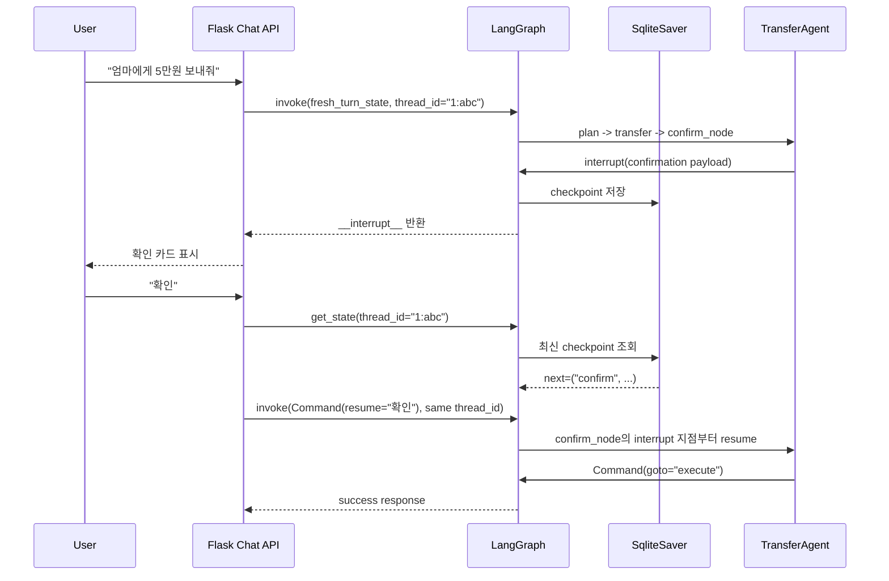
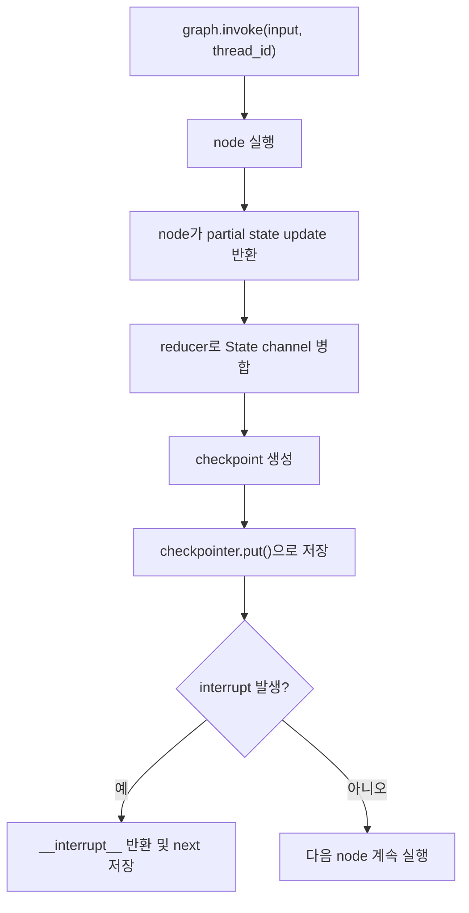
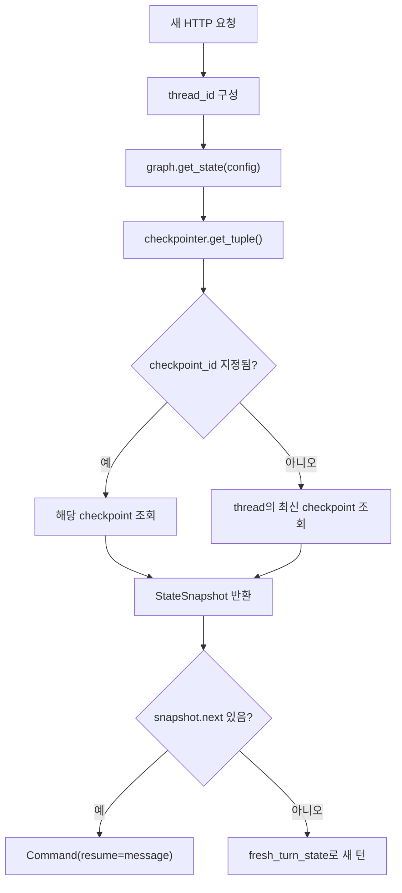

# HITL, Command, Checkpoint 동작 발표자료 (발표자용)

이 문서는 발표자용 코멘트가 포함된 버전입니다. 화면공유용 문서는 `HITL_Checkpoint_발표자료.md`를 사용합니다.

이 문서는 `ai-banking-transfer-agent` 프로젝트에서 `interrupt()`와 `Command(resume=...)`를 이용한 Human-in-the-Loop(HITL)가 어떻게 이전 상태를 기억하고, 다음 요청에서 이전 Node를 다시 처음부터 밟지 않고 이어지는지 설명하기 위한 발표용 자료입니다.

핵심 메시지는 다음 한 문장입니다.

> 이 프로젝트는 `checkpoint_id`를 애플리케이션 코드가 직접 들고 다니는 방식이 아니라, `thread_id = user_id:session_id`를 LangGraph에 넘겨 같은 대화 흐름의 최신 checkpoint를 자동으로 조회하고, pending interrupt가 있으면 `Command(resume=사용자입력)`으로 멈춘 지점에 답을 넣어 이어간다.

---

## 1. 먼저 전체 그림



발표 멘트:

> 사용자가 처음 “이체해줘”라고 말하면 그래프는 수신자 확인, 금액 검증, 보안 검토를 지나 확인 카드에서 멈춥니다. 이때 멈춘 위치와 State가 SqliteSaver에 저장됩니다. 다음 요청에서 같은 `thread_id`로 조회하면 LangGraph는 “이 사람은 지금 confirm 단계에서 답을 기다리는 중”이라는 것을 압니다. 그래서 새로 `plan`부터 시작하지 않고 `Command(resume="확인")`으로 방금 멈춘 `interrupt()`의 반환값에 “확인”을 꽂아 넣습니다.

---

## 2. SqliteSaver가 무엇인가?

`SqliteSaver`는 LangGraph의 checkpointer 구현체 중 하나입니다.

Checkpointer는 그래프 실행 중간중간의 상태를 checkpoint로 저장하는 저장 계층입니다. LangGraph 공식 문서에서는 checkpointer를 conversation continuity, human-in-the-loop, time travel, fault tolerance에 쓰는 thread-scoped short-term memory라고 설명합니다.

이 프로젝트에서는 다음 코드로 사용합니다.

```python
_conn = sqlite3.connect(checkpoint_path, check_same_thread=False)
_graph = build_banking_graph(checkpointer=SqliteSaver(_conn))
```

코드 위치:

- `src/agents/supervisor/graph.py`: `SqliteSaver` import
- `src/agents/supervisor/graph.py`: `_get_graph()`에서 SQLite connection 생성
- `src/agents/supervisor/graph.py`: `build_banking_graph(checkpointer=SqliteSaver(_conn))`

### "구현체 중 하나"라는 말의 의미

여기서 "구현체"라는 말은 조금 풀어 설명할 필요가 있습니다.

LangGraph에는 `BaseCheckpointSaver`라는 공통 규격이 있습니다. 이 규격은 대략 다음 일을 할 수 있어야 합니다.

| 메서드 | 의미 |
|---|---|
| `get` / `get_tuple` | 특정 thread의 checkpoint를 조회 |
| `list` | thread 안의 checkpoint 목록 조회 |
| `put` | checkpoint 저장 |
| `put_writes` | node/task가 만든 중간 write 저장 |
| `delete_thread` | 특정 thread의 checkpoint와 writes 삭제 |

즉 checkpointer의 역할은 "그래프 상태를 저장하고 다시 꺼낼 수 있는 공통 인터페이스"입니다. 그런데 실제 저장소는 프로젝트마다 다를 수 있습니다.

```text
Checkpointer interface
  ├─ InMemorySaver     -> Python 메모리에 저장
  ├─ SqliteSaver       -> SQLite 파일 DB에 저장
  ├─ AsyncSqliteSaver  -> SQLite 파일 DB에 async 방식으로 저장
  ├─ PostgresSaver     -> PostgreSQL에 저장
  └─ AsyncPostgresSaver -> PostgreSQL에 async 방식으로 저장
```

정리하면 다음과 같습니다.

| 구현체 | 저장 위치 | 적합한 상황 |
|---|---|---|
| `InMemorySaver` | Python 프로세스 메모리 | 튜토리얼, 단위 테스트, 빠른 실험 |
| `SqliteSaver` | SQLite 파일 | 로컬 데모, 단일 서버, 작은 프로젝트 |
| `AsyncSqliteSaver` | SQLite 파일 | async 앱에서 가벼운 영속 저장 |
| `PostgresSaver` | PostgreSQL | 운영 환경, 다중 서버, 중앙 DB |
| `AsyncPostgresSaver` | PostgreSQL | async 운영 환경 |

발표 멘트:

> Checkpointer는 역할이고, Saver는 저장 방식입니다. LangGraph는 "checkpoint를 저장하고 조회한다"는 공통 규격을 갖고 있고, 우리는 그중 SQLite에 저장하는 구현체인 `SqliteSaver`를 선택했습니다. 나중에 운영 환경으로 가면 같은 개념을 PostgreSQL saver로 바꿀 수 있습니다.

### 왜 SqliteSaver를 쓰는가?

이 프로젝트의 목적에는 SQLite checkpointer가 적절합니다.

1. 데모와 로컬 개발에 가볍습니다.
2. 별도 서버 없이 파일 기반으로 checkpoint를 유지할 수 있습니다.
3. Flask 프로세스가 재시작되어도 파일이 남아 있으면 같은 `thread_id`의 checkpoint를 다시 읽을 수 있습니다.
4. `interrupt()` 기반 HITL을 구현할 때 수동으로 `pending_state`, `state_json`, `current_node` 같은 상태 머신을 만들 필요가 줄어듭니다.

즉 과거 방식이 이랬다면:

```text
chat_sessions.state_json에 직접 JSON 저장
pending_state = "awaiting_confirmation"
다음 요청에서 if pending_state == ... 로 분기
```

현재 방식은 이렇습니다.

```text
LangGraph가 StateSnapshot과 다음 실행 위치를 checkpoint로 저장
애플리케이션은 thread_id만 유지
다음 요청에서 get_state()로 pending interrupt 여부 확인
pending이면 Command(resume=message)
```

### SQLite가 운영 최종 답인가?

아닙니다. 발표에서는 이렇게 말하는 것이 안전합니다.

> 현재 프로젝트는 데모와 단일 서버 실행을 전제로 `SqliteSaver`를 사용합니다. 운영 환경에서 다중 서버, 고가용성, 중앙 집중 관리가 필요하다면 Postgres 기반 checkpointer 같은 외부 DB checkpointer를 검토하는 것이 자연스럽습니다.

---

## 2-1. Checkpoint는 기본적으로 어떻게 작동하나?

Checkpoint는 "어느 순간의 그래프 상태 snapshot"입니다. LangGraph의 checkpoint에는 단순히 사용자 메시지 하나만 들어가는 것이 아니라, 그래프가 이어서 실행되기 위해 필요한 실행 정보가 함께 들어갑니다.

공식 reference에서 checkpoint는 다음과 같은 성격의 값을 가집니다.

| 항목 | 의미 |
|---|---|
| `id` | checkpoint의 고유 ID. 시간순 정렬 가능한 ID |
| `channel_values` | State channel별 현재 값 |
| `channel_versions` | 각 channel의 버전 |
| `versions_seen` | 각 node가 어떤 channel version을 이미 봤는지 |
| `updated_channels` | 이번 checkpoint에서 갱신된 channel |

이 정보가 중요한 이유는 다음과 같습니다.

```text
State 값만 저장하면:
  "금액이 5만원이다"는 알 수 있음
  하지만 "다음에 어느 node부터 실행해야 하는지"는 별도로 추적해야 함

Checkpoint를 저장하면:
  "금액이 5만원이다"
  "confirm node에서 interrupt 대기 중이다"
  "plan/resolve/validate는 이미 처리했다"
  "다음 resume 값은 interrupt의 반환값으로 들어가야 한다"
  를 함께 복원할 수 있음
```

그래서 LangGraph checkpoint는 단순한 채팅 history보다 더 실행 지향적인 저장 방식입니다.

### 기본 저장 흐름



### 기본 조회 흐름



발표 멘트:

> Checkpoint는 단순히 대화 내용을 저장하는 history가 아닙니다. LangGraph가 다음 실행을 결정할 수 있도록 state 값, channel version, node가 이미 본 version, 다음 task 정보를 함께 저장합니다. 그래서 같은 `thread_id`로 돌아오면 "이전 대화가 있었다" 정도가 아니라 "어느 node에서 멈췄고 다음에 무엇을 실행해야 하는지"까지 복원됩니다.

### SqliteSaver의 실제 테이블 감각

`SqliteSaver`는 내부적으로 SQLite에 필요한 테이블을 만듭니다. 공식 구현 기준으로 핵심 테이블은 다음 두 개입니다.

```sql
CREATE TABLE IF NOT EXISTS checkpoints (
    thread_id TEXT NOT NULL,
    checkpoint_ns TEXT NOT NULL DEFAULT '',
    checkpoint_id TEXT NOT NULL,
    parent_checkpoint_id TEXT,
    type TEXT,
    checkpoint BLOB,
    metadata BLOB,
    PRIMARY KEY (thread_id, checkpoint_ns, checkpoint_id)
);

CREATE TABLE IF NOT EXISTS writes (
    thread_id TEXT NOT NULL,
    checkpoint_ns TEXT NOT NULL DEFAULT '',
    checkpoint_id TEXT NOT NULL,
    task_id TEXT NOT NULL,
    idx INTEGER NOT NULL,
    channel TEXT NOT NULL,
    type TEXT,
    value BLOB,
    PRIMARY KEY (thread_id, checkpoint_ns, checkpoint_id, task_id, idx)
);
```

여기서 중요한 것은 다음입니다.

| 테이블 | 의미 |
|---|---|
| `checkpoints` | 완성된 checkpoint snapshot 저장 |
| `writes` | 특정 checkpoint에 연결된 node/task의 중간 write 저장 |

`SqliteSaver`의 조회 로직은 config에 `checkpoint_id`가 있으면 그 checkpoint를 조회하고, 없으면 같은 `thread_id`의 최신 checkpoint를 조회합니다.

이 프로젝트의 일반 resume은 `checkpoint_id`를 넣지 않습니다.

```python
config = {"configurable": {"thread_id": f"{user_id}:{session_id}"}}
```

따라서 checkpointer는 같은 thread의 최신 checkpoint를 가져옵니다.

---

## 3. thread_id는 원래 저렇게 쓰는 것인가?

`thread_id` 자체는 LangGraph의 표준 개념입니다.

LangGraph는 checkpointer를 사용할 때 config의 `configurable.thread_id`를 보고 어느 thread의 checkpoint를 저장하고 조회할지 결정합니다.

```python
config = {"configurable": {"thread_id": "some-thread-id"}}
```

이 프로젝트의 구체적인 값 구성은 프로젝트 설계입니다.

```python
config = {"configurable": {"thread_id": f"{user_id}:{session_id}"}}
```

즉 `thread_id`를 써야 한다는 것은 LangGraph 방식이고, `user_id:session_id` 형태로 만든 것은 이 프로젝트의 선택입니다.

### 왜 user_id와 session_id를 합쳤나?

`session_id`만 써도 동작할 수 있습니다. 하지만 이 프로젝트에서는 다음 이유로 `user_id`까지 넣는 편이 설명 가능하고 안전합니다.

| 구성 | 의미 |
|---|---|
| `user_id` | 어떤 사용자의 대화인지 |
| `session_id` | 그 사용자의 어떤 채팅 세션인지 |
| `user_id:session_id` | 특정 사용자의 특정 세션 timeline |

예:

```text
1:8e2c...  -> 1번 사용자의 A 채팅 세션
1:b39a...  -> 1번 사용자의 B 채팅 세션
2:8e2c...  -> 2번 사용자의 A 채팅 세션
```

발표 멘트:

> `thread_id`는 LangGraph가 쓰는 “대화 흐름의 주소”입니다. 다만 그 주소를 어떤 문자열로 만들지는 애플리케이션이 정합니다. 우리는 사용자가 바뀌거나 채팅 세션이 바뀌면 checkpoint timeline도 분리되도록 `user_id:session_id`를 사용했습니다.

주의할 점:

- 같은 대화를 이어가려면 같은 `session_id`가 유지되어야 합니다.
- `/api/chat/reset`은 기존 checkpoint를 찾아 삭제한다기보다 새 `session_id`를 발급해 새 thread를 시작하는 방식입니다.
- 사용자 전환 시에도 새 `session_id`를 발급해 이전 사용자의 checkpoint와 섞이지 않게 합니다.

---

## 4. checkpoint_id는 어디에 있나?

`checkpoint_id`는 LangGraph가 checkpoint마다 내부적으로 부여하는 개별 저장본 ID입니다.

비유하면:

```text
thread_id       = 하나의 파일철 이름
checkpoint_id   = 파일철 안의 특정 페이지 번호
```

일반적인 resume에서는 애플리케이션이 `checkpoint_id`를 직접 넘기지 않습니다. `thread_id`만 넘기면 checkpointer가 해당 thread의 최신 checkpoint를 가져옵니다.

`checkpoint_id`를 명시적으로 쓰는 경우는 보통 다음과 같습니다.

1. 과거 특정 시점으로 time travel 하고 싶을 때
2. state history를 조회해서 특정 checkpoint에서 replay하고 싶을 때
3. 디버깅이나 감사 목적으로 특정 checkpoint를 재현하고 싶을 때

이 프로젝트의 일반 채팅 흐름은 최신 checkpoint를 이어가는 모델이므로 `checkpoint_id`를 직접 저장하거나 노출하지 않습니다.

---

## 5. graph.get_state()는 어떤 의미인가?

현재 코드의 핵심 부분입니다.

```python
snapshot = graph.get_state(config)
has_pending = bool(snapshot.next)
```

`graph.get_state(config)`는 해당 `thread_id`의 최신 checkpoint를 읽어서 `StateSnapshot`을 반환하는 작업입니다.

단순히 “현재 Python 메모리에 있는 dict를 가져온다”가 아닙니다. checkpointer가 있으면 `config`에 들어 있는 `thread_id`를 기준으로 저장소에서 최신 checkpoint를 조회합니다.

이 snapshot에는 대략 다음 성격의 정보가 들어 있습니다.

| 항목 | 의미 |
|---|---|
| `values` | checkpoint 시점의 State 값들 |
| `next` | 다음에 실행 예정인 node/task |
| `config` | 이 checkpoint를 가리키는 config |
| `metadata` | checkpoint 생성 원인, step 등 메타데이터 |
| `tasks` | pending task, interrupt 등 실행 관련 정보 |

이 프로젝트에서는 `snapshot.next`만 사용합니다.

```python
has_pending = bool(snapshot.next)
```

의미:

```text
next가 비어 있음     -> 그래프가 끝난 상태. 새 턴으로 시작해도 됨.
next가 남아 있음     -> interrupt 등으로 중간에 멈춘 상태. resume 해야 함.
```

발표 멘트:

> `get_state()`는 “지금 이 세션이 어디까지 진행됐지?”를 LangGraph에게 물어보는 것입니다. 우리는 그중에서도 `snapshot.next`만 보고, 기다리는 node가 있으면 사용자 입력을 새 요청으로 보지 않고 resume 값으로 취급합니다.

---

## 6. State 값은 어디에 어떻게 저장되는가?

이 프로젝트의 State schema는 `src/agents/state.py`의 `BankingState`입니다.

주요 값:

```python
class BankingState(TypedDict, total=False):
    user_id: Annotated[int, _replace]
    session_id: Annotated[str, _replace]
    current_message: Annotated[str, _replace]

    recipient_alias: Annotated[Optional[str], _replace]
    amount: Annotated[Optional[int], _replace]
    pending_transfer_data: Annotated[Optional[Dict[str, Any]], _replace]
    risk_assessment: Annotated[Optional[Dict[str, Any]], _replace]

    agent_activity: Annotated[List[Dict[str, Any]], _accumulate]
    node_logs: Annotated[List[Dict[str, Any]], _accumulate]
    graph_trace: Annotated[List[str], _accumulate]
```

### 파일인가, 캐시인가, JSON인가?

현재 개발 설정 기준으로는 SQLite 파일입니다.

설정 위치:

```python
CHECKPOINT_DB_PATH = os.getenv("CHECKPOINT_DB_PATH", "banking_checkpoints.db")
```

즉 기본값은 프로젝트 루트의 `banking_checkpoints.db`입니다. SQLite는 보통 다음 파일들을 함께 만들 수 있습니다.

```text
banking_checkpoints.db
banking_checkpoints.db-wal
banking_checkpoints.db-shm
```

`-wal`, `-shm`은 SQLite WAL 모드에서 생기는 보조 파일입니다. checkpoint의 실제 영속 저장은 SQLite가 관리합니다.

테스트 환경에서는 다릅니다.

```python
CHECKPOINT_DB_PATH = ":memory:"
```

테스트에서는 메모리 SQLite를 사용하므로 파일이 남지 않습니다.

### 내부적으로 JSON 한 덩어리인가?

"애플리케이션이 직접 JSON 파일로 저장한다"는 뜻은 아닙니다.

앞의 `2-1. Checkpoint는 기본적으로 어떻게 작동하나?`에서 본 것처럼, `SqliteSaver`는 SQLite의 `checkpoints`, `writes` 테이블에 직렬화된 checkpoint snapshot과 중간 write를 저장합니다. 직렬화 포맷은 LangGraph serializer가 관리합니다.

따라서 발표에서는 이렇게 설명하는 것이 가장 정확합니다.

```text
직접 JSON 파일 저장      X
Flask session 저장       X
브라우저 localStorage    X
LangGraph checkpointer가 SQLite에 직렬화 저장  O
```

즉 "우리가 보기 좋은 JSON으로 전부 저장한다"기보다는 "LangGraph가 StateSnapshot과 writes를 SQLite BLOB 형태로 직렬화해 저장한다"가 더 정확합니다.

발표 멘트:

> State는 Flask session이나 브라우저 localStorage에 저장되는 것이 아닙니다. `BankingState`의 값과 실행 메타정보가 LangGraph checkpointer를 통해 SQLite에 저장됩니다. 우리는 JSON 저장/로드 코드를 직접 작성하지 않고, LangGraph의 checkpoint API를 사용합니다.

---

## 7. State reducer는 저장과 무슨 관계가 있나?

`BankingState`의 각 key에는 reducer가 붙어 있습니다.

```python
def _replace(_old, new):
    return new

def _accumulate(old, new):
    return list(old or []) + list(new)
```

의미:

| reducer | 사용 예 | 의미 |
|---|---|---|
| `_replace` | `amount`, `recipient_alias`, `pending_transfer_data` | 새 값이 이전 값을 대체 |
| `_accumulate` | `agent_activity`, `node_logs`, `graph_trace` | 리스트를 누적 |

이 reducer는 checkpoint 저장 포맷이라기보다, 여러 node가 partial update를 반환했을 때 LangGraph가 State를 병합하는 규칙입니다.

예:

```python
return Command(goto="validate_and_secure", update={"amount": 30000})
```

이 update가 적용되면 `amount` channel은 `_replace`에 따라 `30000`이 됩니다. 그리고 그 결과가 다음 checkpoint에 저장됩니다.

---

## 8. Interrupt가 발생하면 실제로 무슨 일이 생기나?

확인 단계 코드를 단순화하면 다음과 같습니다.

```python
reply = interrupt({
    "kind": "confirmation",
    "response_type": "confirmation",
    "response_text": text,
    "response_data": {**data, "risk": risk},
})

if parsing.is_confirmation(reply):
    return Command(goto="otp" if requires_otp else "execute")
```

첫 번째 실행에서는 `interrupt(...)`에서 멈춥니다.

이때 외부로는 다음처럼 보입니다.

```python
result["__interrupt__"] = [...]
```

그래서 `run_banking_agent()`는 interrupt payload를 UI 응답으로 바꿉니다.

```python
interrupts = result.get("__interrupt__") or []
if interrupts:
    payload = interrupts[0].value
    pending_state = _PENDING_STATE_BY_KIND.get(payload.get("kind", ""), "awaiting_input")
```

여기서 `pending_state`는 UI와 로그를 위한 값입니다. resume을 결정하는 진짜 기준은 `pending_state`가 아니라 다음 요청의 `graph.get_state(config)`와 `snapshot.next`입니다.

---

## 9. Command(resume=...)는 무엇을 하나?

다음 요청에서 사용자가 “확인”을 입력했다고 가정합니다.

```python
graph_input = Command(resume=message)
result = graph.invoke(graph_input, config=config, context=ctx)
```

그러면 `"확인"`은 새 `current_message`로 처음부터 들어가는 것이 아니라, 이전에 멈춘 `interrupt()` 호출의 반환값이 됩니다.

즉 이 코드에서:

```python
reply = interrupt(...)
```

resume 후에는:

```python
reply == "확인"
```

이 됩니다.

그래서 바로 아래 로직이 실행됩니다.

```python
if parsing.is_confirmation(reply):
    return Command(goto="otp" if requires_otp else "execute")
```

발표 멘트:

> `Command(resume=...)`는 새 출발 명령이 아니라 “아까 멈춘 질문에 대한 답변”입니다. 확인 카드에서 멈췄다면 resume 값은 확인 카드의 답변이 됩니다. OTP에서 멈췄다면 resume 값은 OTP 입력값이 됩니다.

---

## 10. 이전 Node들은 왜 스킵되는가?

LangGraph checkpoint에는 State 값뿐 아니라 실행 위치와 channel version 정보도 저장됩니다.

그래프는 다음을 알고 있습니다.

1. 어떤 State channel이 업데이트되었는지
2. 어떤 node가 어떤 version의 state를 이미 봤는지
3. 다음에 실행해야 하는 node/task가 무엇인지
4. interrupt 때문에 어떤 task가 pending 상태인지

그래서 같은 `thread_id`로 resume하면 처음 `START -> plan`부터 다시 시작하지 않고, 저장된 pending task 기준으로 이어갑니다.

다만 중요한 nuance가 있습니다.

> `interrupt()`가 들어 있는 node는 resume 때 다시 진입할 수 있습니다. 하지만 `interrupt()` 호출은 저장된 resume 값을 반환하므로, 코드상으로는 interrupt 이후 부분부터 자연스럽게 이어지는 것처럼 동작합니다.

따라서 resume-safe한 코드를 작성하려면 `interrupt()` 이전에 외부 부작용을 두지 않는 것이 좋습니다.

이 프로젝트는 이체 실행이라는 실제 DB 변경을 확인/OTP 뒤의 `execute_node`에 배치했습니다. 그래서 확인 카드 표시 전까지는 실제 송금 부작용이 발생하지 않습니다.

---

## 11. Command(goto=...)와 Command(graph=Command.PARENT)는 무엇인가?

`Command`는 LangGraph에서 state update와 control flow를 함께 반환하는 객체입니다.

### Command(goto=...)

같은 graph 안에서 다음 node를 지정합니다.

```python
return Command(goto="validate_and_secure", update={"amount": amount})
```

의미:

```text
State의 amount를 갱신하고,
다음 node는 validate_and_secure로 이동한다.
```

### Command(graph=Command.PARENT)

subgraph 안에서 부모 graph로 제어권을 넘깁니다.

이 프로젝트에서는 확인 대기 중 사용자가 “잔고 얼마야?”처럼 새 요청을 말하면 TransferAgent가 Supervisor의 `plan`으로 되돌립니다.

```python
return Command(
    graph=Command.PARENT,
    goto="plan",
    update={
        "current_message": message,
        "pending_transfer_data": None,
        ...
    },
)
```

발표 멘트:

> 확인 대기 중이라고 해서 모든 입력을 무조건 “확인 카드의 답변”으로만 해석하지 않습니다. “잔고 얼마야?”처럼 새 요청이면 TransferAgent가 부모 Supervisor에게 “이건 내가 처리하던 이체 답변이 아니라 새 요청이니 다시 planning 해줘”라고 넘깁니다.

---

## 12. Context는 저장되지 않는다

이 프로젝트에는 `State`와 `Context`가 분리되어 있습니다.

| 구분 | 저장 여부 | 예 |
|---|---:|---|
| State | checkpoint에 저장 | 금액, 수신자, 후보 목록, 보안 평가, 응답 데이터 |
| Context | checkpoint에 저장하지 않음 | 사용자 나이, 등급, LLM 설정, OTP 기준 금액, 데모 OTP |

`Context`는 매 요청마다 다시 구성되어 `graph.invoke(..., context=ctx)`로 주입됩니다.

발표에서 강조할 점:

> resume이 가능하다고 해서 모든 것이 checkpoint에 들어가는 것은 아닙니다. 그래프가 진행하면서 바뀌는 업무 상태는 State로 저장하고, 실행 환경처럼 매번 다시 주입할 수 있는 값은 Context로 분리합니다.

---

## 13. 실제 코드 흐름 요약

### 13.1 그래프 생성

```python
def build_banking_graph(checkpointer=None):
    g = StateGraph(BankingState, context_schema=BankingContext)
    ...
    return g.compile(checkpointer=checkpointer)
```

### 13.2 checkpointer 연결

```python
_conn = sqlite3.connect(checkpoint_path, check_same_thread=False)
_graph = build_banking_graph(checkpointer=SqliteSaver(_conn))
```

### 13.3 요청마다 thread_id 구성

```python
config = {"configurable": {"thread_id": f"{user_id}:{session_id}"}}
```

### 13.4 pending interrupt 확인

```python
snapshot = graph.get_state(config)
has_pending = bool(snapshot.next)
```

### 13.5 resume 또는 새 턴

```python
if has_pending:
    graph_input = Command(resume=message)
else:
    graph_input = fresh_turn_state(user_id, session_id, message)
```

### 13.6 실행

```python
result = graph.invoke(graph_input, config=config, context=ctx)
```

---

## 14. 발표용 비유

은행 창구 업무로 비유하면 이해하기 쉽습니다.

| 개념 | 비유 |
|---|---|
| `thread_id` | 고객 번호표 + 상담창구 번호 |
| `checkpoint_id` | 상담 파일철 안의 페이지 번호 |
| `State` | 상담 파일에 적힌 업무 내용 |
| `Context` | 오늘 창구의 운영 정책과 고객 등급 정보 |
| `interrupt()` | 직원이 고객에게 “확인해 주세요” 하고 업무를 잠시 멈춤 |
| `Command(resume=...)` | 고객이 다시 와서 “확인입니다”라고 답함 |
| `snapshot.next` | 파일철에 붙은 “다음은 confirm부터” 포스트잇 |
| `SqliteSaver` | 파일철을 보관하는 캐비닛 |

발표 멘트:

> 이 구조의 재미있는 점은 챗봇이 기억력이 좋은 척하는 것이 아니라, 실제로 업무 파일철을 저장한다는 점입니다. 사용자가 “확인”이라고 말했을 때 AI가 눈치로 앞 상황을 추측하는 게 아니라, LangGraph가 “이 thread는 confirm node에서 멈춰 있었다”는 실행 상태를 가지고 이어갑니다.

---

## 15. 자주 나오는 질문과 답변

### Q0. LangGraph의 checkpointer 구현체가 여러 종류라는 말은 무슨 뜻인가요?

LangGraph에는 checkpoint를 저장하고 조회하기 위한 공통 규격이 있고, 실제 저장 위치에 따라 여러 saver가 있습니다. 메모리에 저장하면 `InMemorySaver`, SQLite에 저장하면 `SqliteSaver`, PostgreSQL에 저장하면 `PostgresSaver`입니다. 즉 checkpointer는 역할이고 saver는 저장 방식입니다. 이 프로젝트는 로컬 데모와 단일 서버 구조에 맞춰 `SqliteSaver`를 선택했습니다.

### Q1. `checkpoint_id`를 따로 DB에 저장해야 하나요?

일반 resume 흐름에서는 필요 없습니다. 같은 `thread_id`만 유지하면 최신 checkpoint를 조회합니다. `checkpoint_id`는 특정 과거 시점으로 돌아가는 time travel이나 디버깅에 유용합니다.

### Q2. `pending_state`가 없으면 resume을 못 하나요?

아닙니다. `pending_state`는 UI/로그용입니다. 실제 resume 판단은 `graph.get_state(config)`의 `snapshot.next`로 합니다.

### Q3. State는 Flask session에 저장되나요?

아닙니다. Flask session에는 주로 `session_id`, `user_id` 같은 식별자가 있습니다. 그래프 State는 LangGraph checkpointer를 통해 SQLite에 저장됩니다.

### Q4. State는 사람이 읽을 수 있는 JSON인가요?

애플리케이션이 직접 JSON 파일로 저장하는 구조는 아닙니다. SQLite 테이블에 직렬화된 checkpoint/writes 데이터로 저장됩니다. 내부 serializer가 JSON 계열 또는 msgpack 계열 직렬화를 관리할 수 있으므로, 발표에서는 “SQLite에 직렬화된 snapshot으로 저장된다”고 설명하는 것이 정확합니다.

### Q5. 서버가 재시작되어도 이어지나요?

checkpoint DB 파일이 유지되고, 같은 `thread_id`로 요청이 들어오면 이어질 수 있습니다. 단 테스트처럼 `:memory:`를 쓰면 프로세스 종료 시 사라집니다.

### Q6. 왜 처음부터 다시 실행하지 않나요?

checkpoint에 다음 실행 위치(`next`)와 state version 정보가 저장되어 있기 때문입니다. resume 시 새 입력을 fresh state로 넣지 않고 `Command(resume=...)`를 넘기므로, LangGraph는 pending interrupt를 이어갑니다.

### Q7. 그래도 node가 재실행될 수 있다면 위험하지 않나요?

그래서 node 설계가 중요합니다. `interrupt()` 이전에는 외부 부작용을 피하고, 실제 이체 같은 부작용은 확인과 OTP 이후의 `execute_node`에 둡니다.

### Q8. 여러 사용자가 동시에 쓰면 섞이지 않나요?

`thread_id`가 다르면 checkpoint timeline이 분리됩니다. 이 프로젝트는 `user_id:session_id` 구조라 사용자와 채팅 세션 단위로 분리됩니다.

---

## 16. 팀에 설명할 때의 1분 버전

> 이 프로젝트의 HITL은 수동 상태 머신이 아니라 LangGraph checkpoint 기반입니다. 사용자가 이체 확인 카드에서 멈추면 `interrupt()`가 발생하고, LangGraph는 현재 `BankingState`와 다음 실행 위치를 `SqliteSaver`를 통해 SQLite에 저장합니다. 다음 HTTP 요청이 오면 우리는 같은 `thread_id`, 즉 `user_id:session_id`로 `graph.get_state()`를 호출합니다. `snapshot.next`가 있으면 아직 답을 기다리는 node가 있다는 뜻이므로 새 턴을 시작하지 않고 `Command(resume=message)`를 넣습니다. 그러면 사용자의 “확인”이나 OTP가 방금 멈춘 `interrupt()`의 반환값이 되고, 그래프는 이미 끝난 plan, resolve, validate 단계를 다시 밟지 않고 다음 node로 이어갑니다. `checkpoint_id`는 내부 checkpoint 페이지 번호이고, 일반 채팅 resume에서는 직접 들고 다니지 않습니다.

---

## 17. 코드 근거

| 주제 | 파일 |
|---|---|
| checkpointer compile | `src/agents/supervisor/graph.py` |
| `thread_id` 구성 | `src/agents/supervisor/graph.py` |
| `graph.get_state()`와 `snapshot.next` | `src/agents/supervisor/graph.py` |
| `Command(resume=...)` | `src/agents/supervisor/graph.py` |
| `BankingState` schema와 reducer | `src/agents/state.py` |
| 확인/금액/OTP interrupt | `src/agents/subagents/transfer.py` |
| 확인 대기 중 부모 Supervisor handoff | `src/agents/subagents/transfer.py` |
| 테스트 환경 `:memory:` checkpoint | `tests/conftest.py` |
| 기본 checkpoint DB path | `config.py` |

---

## 18. 참고 링크

- LangGraph Persistence: https://docs.langchain.com/oss/python/langgraph/persistence
- LangGraph Interrupts: https://docs.langchain.com/oss/python/langgraph/interrupts
- LangGraph Checkpointers: https://docs.langchain.com/oss/python/langgraph/checkpointers
- LangGraph Time Travel: https://docs.langchain.com/oss/python/langgraph/use-time-travel
- LangGraph SQLite checkpointer source 참고: https://github.com/langchain-ai/langgraph/blob/main/libs/checkpoint-sqlite/langgraph/checkpoint/sqlite/__init__.py
