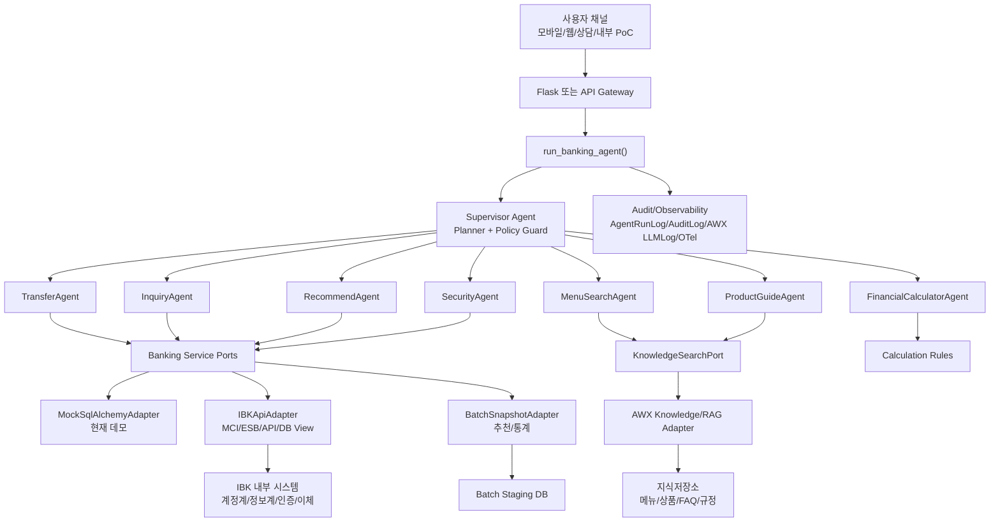

# IBK 기업은행 실투입 대비 추가 개발 계획서

> 작성일: 2026-06-22  
> 대상 저장소: `ai-banking-transfer-agent`  
> 목적: 현재 Mockup 데이터 기반 AI 이체 데모를 실제 IBK 기업은행 프로젝트 투입 가능한 구조로 전환하기 위한 추가 개발 계획 수립

---

## 1. 결론 요약

현재 구현은 LangGraph 기반 Supervisor/Sub-Agent 구조, 이체 Human-in-the-Loop, 결정론적 이체 검증, AWX credential/observability 기초가 이미 마련되어 있다. 따라서 실투입 대비 추가 개발의 핵심은 에이전트를 다시 만드는 것이 아니라, **Mock DB 의존 업무 로직을 실제 연계 Adapter 경계 뒤로 분리**하고, **AWX 지식저장소/RAG 호출과 실시간 고객정보 조회를 서로 다른 신뢰 등급의 데이터 채널로 운영**하는 것이다.

권고 방향은 다음과 같다.

1. **이체 실행, 잔액, 한도, 계좌 상태, 인증 결과는 RAG로 판단하지 않는다.** 반드시 IBK 승인 API, MCI/ESB, 내부 서비스, 또는 검증된 DB view를 통해 실시간 조회한다.
2. **상품 설명, 메뉴 검색, 업무 매뉴얼, FAQ, 규정, 화면 안내, 금융 계산 공식 설명은 AWX 지식저장소/RAG로 처리한다.**
3. **배치 수집 데이터는 추천, 통계, 지식 색인, 과거 패턴 분석 용도로 한정한다.** 고객 잔액/이체 가능 여부처럼 실행 시점 정합성이 필요한 값은 배치 snapshot으로 대체하지 않는다.
4. 현재 `src/agents/common/services/*`가 직접 SQLAlchemy ORM을 읽고 쓰는 구조를 `Port + Adapter` 구조로 바꾼다.
5. 향후 메뉴검색, 금융계산기, 상품안내, 보안설명, 상담원연계 Agent를 추가할 수 있도록 Supervisor의 `ExecutionPlan`, Agent Card, Agent Registry를 확장한다.

---

## 2. 현재 구현 기준 진단

### 2.1 현행 강점

| 영역 | 현재 구현 | 실투입 활용 가능성 |
|---|---|---|
| Agent 구조 | `supervisor`, `transfer`, `inquiry`, `recommend`, `security` Sub-Agent 구성 | 향후 메뉴검색/계산기 Agent 추가 기반으로 사용 가능 |
| 멀티턴 처리 | `interrupt()` + `Command(resume=...)`로 확인/OTP/되묻기 구현 | 실제 인증/확인 UX로 확장 가능 |
| 이체 안전 경계 | 금액, 한도, 잔액, 실행은 결정론 코드에서 처리 | 금융권 안전 원칙에 부합 |
| Runtime Context | `BankingContext`로 사용자/정책/LLM 설정 주입 | 채널/사용자/연계별 정책 주입에 적합 |
| AWX 기초 | `src/awx_runtime/*`, `awx/`, `scripts/build_awx_flow.py` 존재 | AWX 배포/credential/logging 확장 가능 |
| 관측/감사 | `AgentRunLog`, `AuditLog`, node trace 축적 | 운영 감사와 장애 추적 기반으로 사용 가능 |
| A2A Card | `src/agents/a2a/cards.py`로 Agent 능력 명세 | 내부 Agent Registry로 확장 가능 |

### 2.2 실투입 전 주요 갭

| 갭 | 현재 | 실투입 필요 조치 |
|---|---|---|
| DB 접근 | Agent service가 Mock SQLAlchemy 모델 직접 조회/갱신 | `AccountPort`, `TransferPort`, `RecipientPort` 등 인터페이스 분리 |
| 이체 실행 | 로컬 DB balance 차감 + history insert | 승인계/대외계 이체 API 호출, 전문 ID, idempotency, 결과 조회 |
| 잔액/한도 | 로컬 `accounts`, `transfer_limits` 테이블 | 실시간 계좌/한도/거래제한 조회 API |
| 인증 | 데모 OTP `123456` | IBK 인증/OTP/ARS/간편인증 결과 연계 |
| RAG | 아직 업무 지식 retrieval agent 없음 | AWX Knowledge Adapter, citation, grounding, 조회 로그 필요 |
| 배치 | seed mock 데이터만 존재 | 지식/상품/메뉴/통계 snapshot 배치 수집 파이프라인 필요 |
| 개인정보 보호 | 일부 redaction 존재 | 고객정보 등급화, 로그 마스킹 정책, RAG 색인 제외 정책 강화 |
| 운영 오류 | 단순 오류 문구 | IBK 표준 오류코드 매핑, 재시도/보상/조회성 복구 플로우 |
| 권한/세션 | 데모 사용자 선택 | 채널 인증 사용자, 접근권한, 상담/내부직원 권한 모델 필요 |

---

## 3. 데이터 연계 방식별 판단 기준

실제 프로젝트에서는 데이터의 성격에 따라 연계 방식을 분리해야 한다. 모든 것을 RAG로 보내거나, 모든 것을 DB 직결로 처리하면 운영 리스크가 커진다.

### 3.1 데이터 채널 분류

| 데이터/업무 | 권장 채널 | RAG 사용 여부 | 이유 |
|---|---|---:|---|
| 계좌 잔액 | 실시간 API/DB view | 금지 | 실행 시점 정합성 필요 |
| 이체 가능 한도 | 실시간 API/정책 서비스 | 금지 | 이체 전 검증의 authoritative source |
| 계좌 상태, 지급정지, 사고신고 | 실시간 API/계정계 | 금지 | 오판 시 금융 사고 |
| 수취인 실명/계좌 검증 | 승인된 수취인 검증 API | 금지 | 법적/업무 검증 영역 |
| 이체 실행 | 승인계/대외계 API | 금지 | side effect가 있는 거래 |
| 인증/OTP 결과 | 인증 시스템 API | 금지 | 보안 판정 데이터 |
| 거래 내역 조회 | 실시간 API 또는 조회 DB | 제한적 | 답변 요약은 가능하나 원천 데이터는 API |
| 자주 보내는 사람 추천 | 배치 snapshot + 실시간 보정 | 가능 | 추천 근거 설명에 RAG 불필요, 통계/룰로 충분 |
| 메뉴 검색 | AWX 지식저장소/RAG | 허용 | 메뉴명/경로/설명 검색 |
| 상품/수수료/이용안내 | AWX RAG + 원천 링크 | 허용 | 문서 기반 설명, citation 필요 |
| 금융 계산기 공식 설명 | RAG 또는 rule 문서 | 허용 | 계산은 코드, 설명은 RAG |
| 규정/업무 매뉴얼 | AWX RAG | 허용 | 근거 문서와 버전 관리 필요 |

### 3.2 기본 원칙

- **Authoritative Data**: 잔액, 한도, 계좌 상태, 인증, 이체 결과. 반드시 내부 시스템 응답을 원천으로 사용한다.
- **Knowledge Data**: 메뉴, 안내, 상품 설명, FAQ, 규정. AWX 지식저장소/RAG를 사용하되 출처와 문서 버전을 남긴다.
- **Analytic Snapshot**: 추천, 통계, 패턴 분석. 배치 수집 가능하지만 실행 직전에는 실시간 재검증한다.
- **LLM Output**: 계획, 슬롯 추출, 문장 보정, 문서 요약에만 사용한다. 금융 결정값은 코드와 시스템 응답이 결정한다.

---

## 4. 목표 아키텍처



핵심은 Agent가 DB나 AWX SDK를 직접 호출하지 않고, 업무 목적별 Port를 통해 호출한다는 점이다. 이렇게 하면 현재 Mock 데이터와 실제 IBK 연계를 같은 Agent 흐름에서 교체할 수 있다.

---

## 5. Port + Adapter 설계

### 5.1 신규 공통 Port

| Port | 주요 메서드 | 현재 대체 대상 | 실제 연계 대상 |
|---|---|---|---|
| `CustomerContextPort` | `get_customer(user_id)`, `get_channel_profile()` | `User` ORM | 고객/채널 프로필 API |
| `AccountInquiryPort` | `list_accounts()`, `get_balance()`, `get_account_status()` | `balance_service.py` | 계좌조회 API/DB view |
| `TransferLimitPort` | `get_limits()`, `precheck_limit()` | `TransferLimit` ORM | 한도/정책 서비스 |
| `RecipientPort` | `find_favorites()`, `verify_recipient()`, `resolve_alias()` | `Favorite`, `Recipient`, `AliasMemory` ORM | 즐겨찾기/수취인 검증/고객별 별칭 저장소 |
| `TransferExecutionPort` | `prepare_transfer()`, `execute_transfer()`, `get_transfer_result()` | 로컬 balance 차감 | 이체 승인 API |
| `AuthPort` | `request_auth()`, `verify_auth_result()` | 데모 OTP | OTP/ARS/간편인증 시스템 |
| `TransactionHistoryPort` | `recent_transfers()`, `get_transfer_detail()` | `TransferHistory` ORM | 거래내역 조회 API |
| `RecommendationPort` | `recommend_recipients()` | `recommendation_service.py` | 배치 통계 + 실시간 보정 |
| `KnowledgeSearchPort` | `retrieve()`, `answer_with_sources()` | 없음 | AWX Knowledge/RAG |
| `AuditEventPort` | `write_event()`, `write_external_call()` | `AuditLog`, `AgentRunLog` | 로컬 DB + AWX/운영 로그 |

### 5.2 Adapter 구성

| Adapter | 목적 | 적용 시점 |
|---|---|---|
| `MockBankingAdapter` | 현재 데모 DB 기반 동작 보존 | 즉시 |
| `IBKApiAdapter` | 실제 API/MCI/ESB/DB view 연동 | 실투입 환경 확정 후 |
| `AWXKnowledgeAdapter` | AWX 지식저장소/RAG 호출 | 즉시 skeleton 구현 가능 |
| `BatchSnapshotAdapter` | 배치로 적재된 추천/통계/지식 metadata 조회 | 배치 설계 확정 후 |
| `Noop/FallbackAdapter` | 연계 미구성 시 안전한 메시지 반환 | 개발/테스트 |

---

## 6. 이체 서비스 실투입 설계

### 6.1 이체 처리 표준 흐름

```text
1. 사용자 발화 수신
2. Supervisor가 transfer 업무로 라우팅
3. TransferAgent가 슬롯 추출
4. 수신자 후보 해석
5. 실시간 계좌/잔액/한도/거래제한 조회
6. 수취인 검증 또는 등록 수취인 확인
7. 보안/사기 룰 평가
8. 사용자 확인 카드 생성
9. 인증 필요 시 AuthPort로 인증 요청/검증
10. 이체 실행 요청 생성
11. TransferExecutionPort.execute_transfer(idempotency_key) 호출
12. 결과 조회/영수증 생성
13. AuditLog, AgentRunLog, 외부 호출 로그 저장
14. 실패 시 표준 오류코드 기반 복구 안내
```

### 6.2 이체 실행 안전장치

| 안전장치 | 구현 내용 |
|---|---|
| Idempotency Key | `user_id + session_id + confirmation_version + nonce` 기반으로 중복 실행 방지 |
| Confirmation Snapshot | 사용자가 확인한 수신자/금액/수수료/잔액/한도/위험경고를 immutable snapshot으로 저장 |
| 실행 직전 재검증 | 확인 후 시간이 지났거나 인증 후 지연된 경우 잔액/한도/계좌상태 재조회 |
| 인증 분리 | Agent는 인증을 직접 판단하지 않고 AuthPort 결과만 신뢰 |
| 오류코드 매핑 | 잔액부족, 한도초과, 수취인불일치, 시스템장애, 인증실패를 표준 메시지로 변환 |
| 보상/조회 | 실행 결과 불명확 시 `get_transfer_result()`로 최종 상태 조회 |
| 로그 마스킹 | 외부 observability에는 계좌번호 뒤 4자리, 금액 bucket, 상태코드 중심 기록 |
| 정책 토글 | 실투입 전 `TRANSFER_EXECUTION_MODE=mock|dry_run|live`로 단계적 전환 |

### 6.3 현재 코드 기준 변경 위치

| 현재 파일 | 변경 방향 |
|---|---|
| `src/agents/common/services/transfer_service.py` | SQLAlchemy 직접 실행을 `TransferExecutionPort` 호출로 분리 |
| `src/agents/common/services/balance_service.py` | `AccountInquiryPort`, `TransferLimitPort` 호출로 분리 |
| `src/agents/common/services/recipient_service.py` | `RecipientPort`로 분리 |
| `src/agents/subagents/transfer.py` | workflow는 유지하되 service 호출을 Port로 교체 |
| `src/agents/subagents/security.py` | 룰은 유지하고 실제 위험/제한 정보는 Port로 보강 |
| `src/models/database.py` | 데모 테이블과 운영 감사/요청 상태 테이블을 분리 |

---

## 7. AWX 지식저장소/RAG 설계

### 7.1 RAG 대상

| 컬렉션 | 예시 | Agent |
|---|---|---|
| `menu_catalog` | 메뉴명, 앱 화면 경로, 업무 코드, 권한 | `MenuSearchAgent` |
| `product_docs` | 예금/대출/카드/외환 상품 설명 | `ProductGuideAgent` |
| `fee_policy_docs` | 수수료 안내, 면제 조건 | `ProductGuideAgent`, `TransferAgent` 설명 보조 |
| `faq_docs` | 고객센터 FAQ, 오류별 안내 | `Supervisor`, `GuideAgent` |
| `operation_manuals` | 내부 업무 매뉴얼, 상담 스크립트 | 내부/상담 Agent |
| `calculation_docs` | 이자/환율/상환 계산 공식 설명 | `FinancialCalculatorAgent` |

### 7.2 RAG 비대상

- 고객별 잔액, 계좌번호, 주민/CI/DI, 인증 결과
- 이체 가능 여부, 계좌 지급정지 상태, 사고신고 상태
- 이체 실행 결과, 승인 전문 원문
- 개인 거래내역 원문 전체

### 7.3 RAG 호출 표준 흐름

```text
1. Supervisor가 지식형 질문인지 판정
2. KnowledgeSearchPort.retrieve(query, filters) 호출
3. AWXKnowledgeAdapter가 컬렉션/권한/문서버전 기준 retrieval
4. rerank 또는 score threshold 적용
5. 근거 문서 chunk와 metadata를 반환
6. LLM이 답변을 생성하되 근거 밖 추론은 제한
7. 답변에 출처/문서명/버전/업데이트일을 response_data로 저장
8. retrieval 로그와 LLMLog를 마스킹 후 적재
```

### 7.4 RAG 품질 기준

| 기준 | 목표 |
|---|---|
| Top-k 정답 포함률 | 메뉴/FAQ 평가셋 기준 90% 이상 |
| 근거 없는 답변 | score threshold 미달 시 답변 보류 |
| 출처 표시 | 운영/검증 화면에는 문서명, 버전, chunk id 노출 |
| 최신성 | 문서별 `effective_from`, `updated_at`, `retired_at` 관리 |
| 권한 | 내부 매뉴얼과 고객 공개 문서 컬렉션 분리 |

---

## 8. Supervisor Agent 확장 구조

### 8.1 목표 Agent 목록

| Agent | 역할 | 실행 특성 |
|---|---|---|
| `TransferAgent` | 이체 준비/검증/확인/실행 | side effect 있음, 단독 workflow |
| `InquiryAgent` | 잔액, 내역, 자동이체 조회 | read-only, 실시간 API |
| `RecommendAgent` | 자주 보내는 사람/금액 추천 | read-only, 배치+통계 |
| `SecurityAgent` | 리스크 평가, 인증 강화 판단 | read-only 판단, 정책 룰 |
| `MenuSearchAgent` | 앱/업무 메뉴 위치 검색 | RAG |
| `FinancialCalculatorAgent` | 예금이자, 대출상환, 환전, 수수료 계산 | 계산은 코드, 설명은 RAG |
| `ProductGuideAgent` | 상품/수수료/이용안내 질의응답 | RAG |
| `HandoffAgent` | 상담원/업무부서 연결 안내 | 정책 + RAG |

### 8.2 Supervisor 변경 방향

| 영역 | 현재 | 추가 개발 |
|---|---|---|
| AgentName schema | `transfer|inquiry|recommend|security` literal | registry 기반 enum 생성 또는 확장 literal |
| Agent Card | 정적 dict | capability, risk_level, data_scope, side_effect 필드 추가 |
| Planner | rule + LLM plan | 지식형/거래형/계산형/상담형 분리 정책 추가 |
| 안전 정책 | transfer 단독 제한 | side effect agent는 항상 단독, read-only agent만 병렬 허용 |
| 응답 집계 | 결과 text join | 지식 출처, 계산 trace, 실시간 조회 시각 통합 |

### 8.3 Planner 정책

- `transfer`가 포함되면 다른 Agent와 병렬 실행하지 않는다.
- `menu_search`, `product_guide`는 RAG Agent로 라우팅하되 고객정보가 필요한 경우 먼저 권한과 데이터 범위를 확인한다.
- `financial_calculator`는 계산식 코드 실행 결과를 우선하고, RAG는 공식 설명/주의사항에만 사용한다.
- LLM planner가 side effect Agent를 복수 포함하면 rule validator가 reject하고 안전한 rule plan으로 폴백한다.

---

## 9. 현재 바로 수행할 추가 개발 계획

### Phase 1. 연계 추상화 기반 구축

| 항목 | 내용 |
|---|---|
| 목표 | Mock DB와 실제 IBK 연계를 교체 가능하게 만드는 Port/Adapter 경계 구축 |
| 주요 개발 | `src/integrations/ports.py`, `src/integrations/mock_adapter.py`, `src/integrations/factory.py` 신설 |
| 변경 파일 | `balance_service.py`, `transfer_service.py`, `recipient_service.py`, `inquiry.py`, `transfer.py` |
| 산출물 | 기존 테스트 통과 + MockAdapter로 동일 기능 수행 |
| 우선순위 | 최상 |

### Phase 2. 이체 실행 안전성 강화

| 항목 | 내용 |
|---|---|
| 목표 | 실제 이체 API 연계 전 중복 실행 방지, 상태 추적, 감사 근거 확보 |
| 주요 개발 | `TransferRequest`, `TransferEvent`, `ExternalCallLog` 모델 추가 |
| 변경 파일 | `database.py`, `transfer_service.py`, `transfer.py`, `tests/test_transfer_service.py` |
| 산출물 | 이체 요청 생성, 확인 snapshot, idempotency key, dry-run/live 모드 분리 |
| 우선순위 | 최상 |

### Phase 3. AWX RAG Adapter 골격 구현

| 항목 | 내용 |
|---|---|
| 목표 | 메뉴검색/상품안내 Agent가 AWX 지식저장소를 호출할 수 있는 최소 경계 구현 |
| 주요 개발 | `KnowledgeSearchPort`, `AWXKnowledgeAdapter`, retrieval result schema |
| 변경 파일 | `src/awx_runtime/*`, `src/agents/subagents/menu_search.py`, `src/agents/subagents/product_guide.py` |
| 산출물 | AWX SDK 미존재 시 mock retrieval, 존재 시 AWX resource client 호출 |
| 우선순위 | 높음 |

### Phase 4. Supervisor Agent Registry 확장

| 항목 | 내용 |
|---|---|
| 목표 | 신규 Agent를 코드 여러 곳에 흩어져 추가하지 않고 registry로 등록 |
| 주요 개발 | Agent Card 확장, planner schema 확장, route validator 강화 |
| 변경 파일 | `schemas.py`, `a2a/cards.py`, `supervisor/planner.py`, `supervisor/graph.py` |
| 산출물 | `menu_search`, `financial_calculator`, `product_guide` skeleton routing |
| 우선순위 | 높음 |

### Phase 5. 배치/지식 수집 설계 반영

| 항목 | 내용 |
|---|---|
| 목표 | 실투입 시 문서/메뉴/상품/통계 배치를 안정적으로 받을 수 있는 staging 구조 마련 |
| 주요 개발 | `BatchJob`, `KnowledgeDocument`, `KnowledgeChunk`, `BatchIngestionLog` 모델 또는 외부 staging spec |
| 변경 파일 | `database.py`, 신규 `src/batch/*`, 문서 |
| 산출물 | 배치 수집 명세, 검증 규칙, 재처리/rollback 기준 |
| 우선순위 | 중 |

### Phase 6. 운영 품질/보안 기준 강화

| 항목 | 내용 |
|---|---|
| 목표 | 금융권 운영 감사, 보안 검토, 장애 분석에 필요한 기준 확보 |
| 주요 개발 | 외부 호출 로그 마스킹, 오류코드 매핑, 성능 metric, RAG 평가셋 |
| 변경 파일 | `redaction.py`, `observability.py`, `tracing.py`, tests |
| 산출물 | 테스트/로그/보안 점검 checklist |
| 우선순위 | 높음 |

---

## 10. 프로그램 단위 WBS

### 10.1 공통 연계 기반

| 프로그램 ID | 프로그램/모듈 | 주요 작업 | 산출물 |
|---|---|---|---|
| `PGM-COM-001` | Integration Port 정의 | 계좌, 이체, 인증, RAG, 감사 Port protocol/schema 정의 | `src/integrations/ports.py` |
| `PGM-COM-002` | Adapter Factory | 환경변수로 `mock|ibk|dry_run` adapter 선택 | `src/integrations/factory.py` |
| `PGM-COM-003` | 공통 DTO | 계좌/한도/이체/수취인/인증 응답 DTO 표준화 | `src/integrations/dtos.py` |
| `PGM-COM-004` | 오류코드 매핑 | 내부/외부 오류를 표준 agent error로 변환 | `src/integrations/errors.py` |
| `PGM-COM-005` | 외부 호출 로그 | API 호출 request id, latency, status, redaction 저장 | `ExternalCallLog` |

### 10.2 이체 서비스

| 프로그램 ID | 프로그램/모듈 | 주요 작업 | 산출물 |
|---|---|---|---|
| `PGM-TRF-001` | 이체 요청 생성 | confirmation 전 transfer request draft 생성 | `TransferRequest` |
| `PGM-TRF-002` | 확인 snapshot | 고객이 본 금액/수신자/수수료/경고 immutable 저장 | `confirmation_snapshot_json` |
| `PGM-TRF-003` | 실시간 사전검증 | 잔액, 한도, 계좌상태, 수취인 검증 Port 호출 | precheck result |
| `PGM-TRF-004` | 인증 연계 | 데모 OTP 제거 가능 구조, AuthPort 연결 | auth challenge/result |
| `PGM-TRF-005` | 이체 실행 | idempotency key 기반 execute 호출 | transfer execution result |
| `PGM-TRF-006` | 결과 조회/복구 | 결과 불명확 시 상태조회, 고객 안내 | recovery flow |
| `PGM-TRF-007` | 이체 실패 복구 | 잔액부족/한도초과 시 금액변경/계좌변경 멀티턴 | UX flow |
| `PGM-TRF-008` | 이체 감사 | 요청/확인/인증/실행/결과 이벤트 기록 | `TransferEvent` |

### 10.3 조회/추천

| 프로그램 ID | 프로그램/모듈 | 주요 작업 | 산출물 |
|---|---|---|---|
| `PGM-INQ-001` | 계좌 목록 조회 | Mock DB 대신 AccountInquiryPort 사용 | inquiry adapter |
| `PGM-INQ-002` | 잔액 조회 | 실시간 조회 시각/데이터 출처 표시 | balance response metadata |
| `PGM-INQ-003` | 거래 내역 조회 | 기간/금액/수취인 필터 확장 | history query DTO |
| `PGM-REC-001` | 추천 데이터 소스 | 배치 snapshot + 최근 이체 조회 결합 | recommendation adapter |
| `PGM-REC-002` | 추천 근거 | 추천 사유와 데이터 기준일 표시 | recommendation explainability |

### 10.4 AWX/RAG

| 프로그램 ID | 프로그램/모듈 | 주요 작업 | 산출물 |
|---|---|---|---|
| `PGM-RAG-001` | KnowledgeSearchPort | query, filters, collection, top_k schema 정의 | RAG port |
| `PGM-RAG-002` | AWXKnowledgeAdapter | AWX 지식저장소 client wrapper 구현 | AWX adapter |
| `PGM-RAG-003` | Retrieval Log | query, chunks, score, doc version 기록 | `RagRetrievalLog` |
| `PGM-RAG-004` | 메뉴검색 Agent | 메뉴명/업무명/증상 기반 메뉴 위치 검색 | `menu_search.py` |
| `PGM-RAG-005` | 상품안내 Agent | 상품/수수료/FAQ 답변 + 출처 반환 | `product_guide.py` |
| `PGM-RAG-006` | RAG 평가셋 | 메뉴/FAQ/상품 질문 golden set 구축 | `tests/fixtures/rag_eval.jsonl` |

### 10.5 금융계산기

| 프로그램 ID | 프로그램/모듈 | 주요 작업 | 산출물 |
|---|---|---|---|
| `PGM-CAL-001` | 계산 Agent skeleton | 예금이자/대출상환/환율/수수료 intent route | `financial_calculator.py` |
| `PGM-CAL-002` | 계산 rule engine | 수식은 코드로 계산, LLM 미사용 | calculator services |
| `PGM-CAL-003` | 계산 설명 RAG | 공식/주의사항은 RAG로 설명 | explain-with-source |
| `PGM-CAL-004` | 검증 테스트 | 소수점/원단위/일수/금리 기준 테스트 | pytest |

### 10.6 Supervisor/Agent 플랫폼

| 프로그램 ID | 프로그램/모듈 | 주요 작업 | 산출물 |
|---|---|---|---|
| `PGM-AGT-001` | Agent Registry | Agent Card, risk level, data scope, side effect 등록 | registry |
| `PGM-AGT-002` | Planner schema 확장 | 신규 Agent literal/schema 추가 | `ExecutionPlan` |
| `PGM-AGT-003` | Plan validator | side effect agent 병렬 금지, unknown agent reject | validator |
| `PGM-AGT-004` | 응답 aggregator | 실시간 조회/RAG/계산 결과 통합 표시 | response_data 표준 |
| `PGM-AGT-005` | A2A 표면 확장 | 신규 Agent Card와 invoke 정책 추가 | `/api/a2a/*` |

### 10.7 운영/보안/테스트

| 프로그램 ID | 프로그램/모듈 | 주요 작업 | 산출물 |
|---|---|---|---|
| `PGM-OPS-001` | Redaction 강화 | 계좌/전화/고객식별자/토큰 마스킹 | `redaction.py` |
| `PGM-OPS-002` | Observability | AWX LLMLog/OTel span/외부호출 metric | `observability.py` |
| `PGM-OPS-003` | 회귀 테스트 | 이체/조회/RAG/planner/adapter 테스트 | pytest suite |
| `PGM-OPS-004` | 성능 테스트 | RAG latency, API timeout, concurrent session | smoke/load scripts |
| `PGM-OPS-005` | 보안 점검 | 로그 원문 노출, prompt injection, 권한 검증 | checklist/report |

---

## 11. 실제 투입 시 현장 수행 업무

### 11.1 착수 직후 확인해야 할 항목

| 구분 | 확인 업무 | 담당 협의 대상 |
|---|---|---|
| 시스템 연계 | 계좌조회, 한도조회, 수취인검증, 이체실행, 결과조회 API 존재 여부 | 계정계/채널계/MCI/ESB |
| 인증 | OTP/ARS/간편인증 호출 방식과 callback/polling 방식 | 인증/보안팀 |
| 데이터 권한 | 고객정보 접근 권한, 상담/내부직원 권한 모델 | 보안/개인정보/채널팀 |
| RAG 지식 | 메뉴/상품/FAQ/규정 문서 원천, 업데이트 주기, 공개 범위 | 업무/상품/디지털채널 |
| AWX | 지식저장소 생성 방식, credential, resource id, 배포 정책 | AWX/플랫폼팀 |
| 배치 | 지식/통계/snapshot 적재 경로, 파일 포맷, 기준일 | 정보계/데이터팀 |
| 운영 | 로그 보관 기간, 마스킹 정책, 장애 대응 프로세스 | 운영/감사 |
| 테스트 | 테스트 고객, 테스트 계좌, 이체 sandbox, 망/방화벽 | QA/인프라 |

### 11.2 현장 산출물

| 산출물 | 내용 |
|---|---|
| 연계 인터페이스 목록 | API명, URL/전문 ID, request/response, timeout, 오류코드 |
| 데이터 매핑표 | 현재 DTO와 IBK 필드 매핑, 필수/선택, 마스킹 정책 |
| RAG 컬렉션 설계서 | 컬렉션명, 문서 원천, 권한, chunking, metadata |
| 이체 업무 시퀀스 | 사전검증, 확인, 인증, 실행, 결과조회, 실패복구 흐름 |
| 보안/감사 설계서 | 로그 항목, 원문 보관 여부, 접근통제, retention |
| 테스트 시나리오 | 정상/오류/중복/지연/인증실패/고위험 거래 |
| 배포/운영 가이드 | AWX package/run, 환경변수, credential, rollback |

---

## 12. 제안 데이터 모델 추가

| 테이블/모델 | 목적 |
|---|---|
| `transfer_requests` | 이체 요청의 draft/confirmed/authenticated/executed 상태 관리 |
| `transfer_events` | 이체 요청 lifecycle event 감사 |
| `external_call_logs` | 외부 API 호출 로그, latency, 오류코드, request id |
| `rag_retrieval_logs` | RAG query, collection, chunk id, score, 문서 버전 |
| `knowledge_documents` | 배치/수동 등록 지식 문서 metadata |
| `knowledge_chunks` | chunk id, source doc, version, effective dates |
| `batch_jobs` | 배치 실행 단위, 상태, 기준일, 오류 |
| `agent_tool_calls` | Agent가 호출한 tool/port 이력 |

현재 demo DB 테이블과 운영 감사 테이블은 목적이 다르므로, 실투입 대비 테이블은 명확히 분리하는 것이 좋다.

---

## 13. 우선 구현 순서

바로 개발에 착수한다면 다음 순서를 권장한다.

1. `Port/Adapter` 인터페이스와 DTO를 먼저 만든다.
2. 기존 Mock SQLAlchemy 로직을 `MockBankingAdapter`로 이동한다.
3. TransferAgent가 직접 service를 호출하지 않고 Port를 호출하도록 바꾼다.
4. 이체 요청 상태 모델과 idempotency key를 추가한다.
5. AWX RAG Adapter skeleton과 `MenuSearchAgent`를 추가한다.
6. Supervisor planner schema와 Agent Card를 신규 Agent까지 확장한다.
7. 금융계산기 skeleton을 만들고 계산은 코드 기반 rule로 구현한다.
8. 배치 수집/지식 컬렉션 설계를 문서와 모델로 반영한다.
9. 로그 redaction과 외부 호출 로그를 강화한다.
10. MockAdapter 기준 전체 회귀 테스트를 통과시킨다.

---

## 14. 완료 기준

### 14.1 개발 완료 기준

- 기존 이체 데모 시나리오가 MockAdapter 기반으로 모두 통과한다.
- Agent 코드에서 SQLAlchemy ORM 직접 접근이 핵심 업무 경로에서 제거된다.
- `TRANSFER_EXECUTION_MODE=mock|dry_run|live` 전환 구조가 존재한다.
- 이체 요청은 idempotency key와 상태 이벤트를 가진다.
- AWX 지식검색 Agent가 mock/AWX 양쪽 adapter로 동작한다.
- Supervisor가 `menu_search`, `financial_calculator`, `product_guide`를 route할 수 있다.
- RAG 답변은 출처 metadata를 포함한다.
- 외부 로그에는 민감정보 원문이 노출되지 않는다.

### 14.2 실투입 준비 완료 기준

- IBK API/전문별 request/response 매핑표가 확정된다.
- sandbox 또는 테스트계에서 조회/인증/이체 dry-run이 성공한다.
- RAG 문서 컬렉션과 업데이트 프로세스가 확정된다.
- 보안/개인정보/감사 로그 검토를 통과한다.
- 장애/중복/결과불명/인증실패 시나리오 테스트가 완료된다.
- AWX 배포, rollback, credential rotation 절차가 문서화된다.

---

## 15. 주요 리스크와 대응

| 리스크 | 영향 | 대응 |
|---|---|---|
| RAG가 실시간 고객값을 대체하려는 요구 | 금융 사고 가능 | 데이터 분류 원칙을 설계서와 코드 guard로 고정 |
| 이체 실행 중복 호출 | 중복 출금 | idempotency key, request 상태, 결과조회 필수 |
| API 결과 불명확 | 고객 안내/감사 문제 | 실행 후 상태조회와 pending 안내 flow 구현 |
| 문서 최신성 부족 | 잘못된 메뉴/상품 안내 | 문서 version/effective date와 score threshold 적용 |
| 개인정보 로그 노출 | 보안 사고 | redaction, 원문 저장 위치 제한, 접근권한 분리 |
| Supervisor 오라우팅 | 잘못된 업무 호출 | Plan validator, side effect agent 단독 실행 정책 |
| 실투입 연계 지연 | 개발 정체 | MockAdapter, DryRunAdapter, 계약 테스트로 선행 개발 |

---

## 16. 최종 권고

현재 프로젝트의 다음 개발은 화면 기능을 추가하기보다, **실제 은행 시스템으로 바꿔 끼울 수 있는 업무 경계**를 먼저 만드는 것이 맞다. 특히 이체 서비스는 고객정보 조회, 한도검증, 인증, 실행, 결과조회가 모두 분리된 외부 시스템일 가능성이 높으므로, 지금 바로 `Port + Adapter + TransferRequest 상태 모델`을 도입해야 한다.

AWX/RAG는 이체 실행 판단의 근거가 아니라, 메뉴검색/상품안내/업무지식/계산 설명을 담당하는 지식 계층으로 분리한다. 이 분리가 지켜지면 현재 Supervisor Agent 구조는 IBK 실투입 후에도 메뉴검색, 금융계산기, 상품안내, 상담연계 Agent를 자연스럽게 확장할 수 있다.

