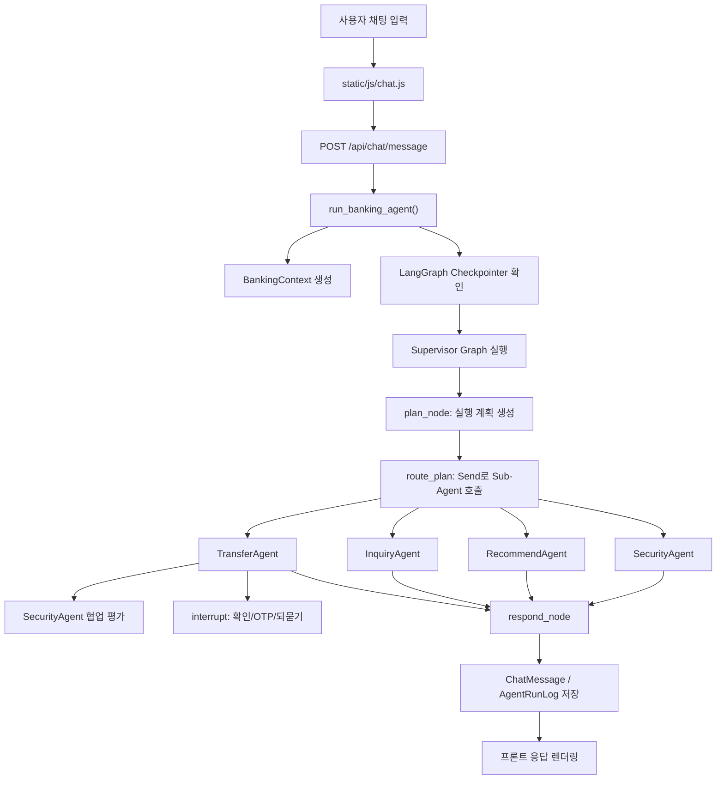
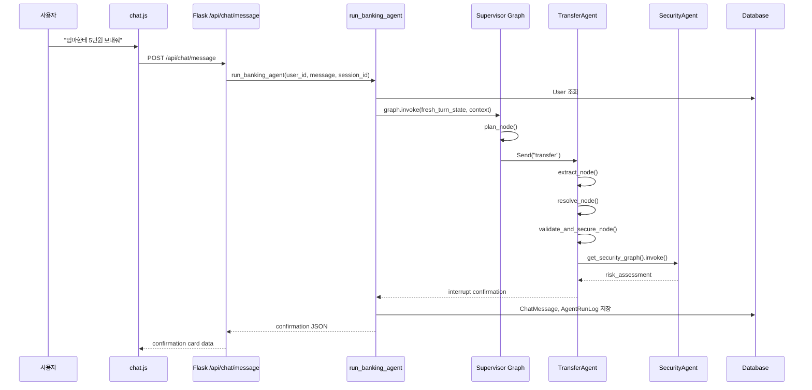

# AI Banking Transfer Agent 코드 워크플로우 상세 가이드

> 목적: 이 문서는 `ai-banking-transfer-agent` 프로젝트를 처음 보는 사람도 코드를 따라가며 전체 흐름을 이해할 수 있도록 만든 프린트용 매뉴얼입니다.

## 목차

1. [프로젝트 한눈에 보기](#1-프로젝트-한눈에-보기)
2. [디렉토리 구조와 역할](#2-디렉토리-구조와-역할)
3. [사용자 질문 1개가 처리되는 전체 흐름](#3-사용자-질문-1개가-처리되는-전체-흐름)
4. [Flask 앱과 채팅 API](#4-flask-앱과-채팅-api)
5. [State, Context, DB, Checkpointer](#5-state-context-db-checkpointer)
6. [Supervisor Agent](#6-supervisor-agent)
7. [Planner: 질문을 실행 계획으로 바꾸는 코드](#7-planner-질문을-실행-계획으로-바꾸는-코드)
8. [Sub-Agent 공통 실행 방식](#8-sub-agent-공통-실행-방식)
9. [TransferAgent 상세 흐름](#9-transferagent-상세-흐름)
10. [InquiryAgent, RecommendAgent, SecurityAgent](#10-inquiryagent-recommendagent-securityagent)
11. [A2A 구현 방식](#11-a2a-구현-방식)
12. [멀티턴 대화 처리 방식](#12-멀티턴-대화-처리-방식)
13. [데이터 저장과 감사 로그](#13-데이터-저장과-감사-로그)
14. [프론트엔드 렌더링과 디버그 패널](#14-프론트엔드-렌더링과-디버그-패널)
15. [실제 예시별 코드 흐름](#15-실제-예시별-코드-흐름)
16. [처음 보는 사람이 읽는 순서](#16-처음-보는-사람이-읽는-순서)
17. [출력과 참고 방법](#17-출력과-참고-방법)

---

## 1. 프로젝트 한눈에 보기

이 프로젝트는 개인 뱅킹 송금 업무를 자연어 대화로 처리하는 데모 애플리케이션입니다.

핵심 구조는 다음과 같습니다.

- Flask 웹앱이 사용자 채팅 메시지를 받습니다.
- `run_banking_agent()`가 LangGraph 실행을 시작하거나 이전 멀티턴 상태를 재개합니다.
- Supervisor Agent가 사용자 질문을 분석해 실행 계획을 만듭니다.
- 실행 계획에 따라 하위 Sub-Agent가 호출됩니다.
- TransferAgent는 확인, OTP, 수신자 되묻기 같은 멀티턴 흐름을 `interrupt()`로 처리합니다.
- DB에는 계좌, 수신자, 이체내역, 채팅 기록, 에이전트 실행 로그, 호칭 학습 메모리가 저장됩니다.
- A2A Agent Card와 JSON-RPC 스타일 엔드포인트를 통해 외부 에이전트가 하위 에이전트를 발견하고 호출할 수 있습니다.

전체 흐름은 아래와 같습니다.



---

## 2. 디렉토리 구조와 역할

주요 파일만 먼저 보면 됩니다.

```text
ai-banking-transfer-agent/
├─ app.py
├─ config.py
├─ seed.py
├─ src/
│  ├─ agents/
│  │  ├─ context.py
│  │  ├─ state.py
│  │  ├─ supervisor/
│  │  │  ├─ graph.py
│  │  │  ├─ planner.py
│  │  │  └─ prompts.py
│  │  ├─ subagents/
│  │  │  ├─ transfer.py
│  │  │  ├─ inquiry.py
│  │  │  ├─ recommend.py
│  │  │  └─ security.py
│  │  ├─ a2a/
│  │  │  └─ cards.py
│  │  └─ common/
│  │     ├─ parsing.py
│  │     ├─ llm.py
│  │     ├─ schemas.py
│  │     ├─ tracing.py
│  │     └─ services/
│  ├─ models/
│  │  └─ database.py
│  └─ web/
│     └─ routes/
│        ├─ chat.py
│        └─ a2a.py
├─ static/
│  └─ js/chat.js
├─ templates/
└─ tests/
```

역할은 다음과 같습니다.

| 위치 | 역할 |
|---|---|
| `app.py` | Flask 앱 생성, DB 초기화, 라우트 등록, 시드 실행 |
| `src/web/routes/chat.py` | 채팅 페이지와 `/api/chat/message` API |
| `src/web/routes/a2a.py` | A2A Agent Card 및 JSON-RPC 스타일 invoke API |
| `src/agents/supervisor/graph.py` | 전체 LangGraph 구성, Supervisor 실행, 체크포인트 처리 |
| `src/agents/supervisor/planner.py` | 사용자 발화를 `ExecutionPlan`으로 변환 |
| `src/agents/subagents/transfer.py` | 자연어 이체, 확인, OTP, 되묻기, 실행 |
| `src/agents/subagents/inquiry.py` | 잔액, 이체내역, 자동이체 조회 |
| `src/agents/subagents/recommend.py` | 수신자 추천 |
| `src/agents/subagents/security.py` | 보안 리포트와 이체 리스크 평가 |
| `src/agents/common/services/*` | DB를 사용하는 순수 업무 서비스 |
| `src/models/database.py` | SQLAlchemy ORM 모델 |
| `static/js/chat.js` | 채팅 요청, 응답 카드 렌더링, 디버그 패널 표시 |

---

## 3. 사용자 질문 1개가 처리되는 전체 흐름

예를 들어 사용자가 다음과 같이 입력했다고 가정합니다.

```text
엄마한테 5만원 보내줘
```

처리 순서는 다음과 같습니다.



사용자가 확인 카드에서 `확인`을 누르면 같은 `session_id`로 다시 요청이 들어옵니다.

```text
확인
```

이번에는 새 그래프를 시작하지 않고, 체크포인터에 남아 있는 interrupt 지점으로 되돌아갑니다.

```python
if has_pending:
    graph_input = Command(resume=message)
else:
    graph_input = fresh_turn_state(user_id, session_id, message)
```

---

## 4. Flask 앱과 채팅 API

### 4.1 앱 생성

파일: `app.py`

```python
def create_app(config_class=Config) -> Flask:
    app = Flask(
        __name__,
        template_folder="templates",
        static_folder="static",
    )
    app.config.from_object(config_class)

    init_db(app)
    register_routes(app)

    return app
```

이 코드는 애플리케이션을 만드는 공장 함수입니다.

하는 일:

1. Flask 객체 생성
2. 설정 로드
3. DB 초기화
4. Blueprint 라우트 등록

앱 실행 시 DB가 비어 있으면 데모 데이터를 넣습니다.

```python
with app.app_context():
    from src.models.database import db, User
    if db.session.query(User).count() == 0:
        import seed
        seed.run(app)
```

### 4.2 채팅 API

파일: `src/web/routes/chat.py`

```python
@bp.route("/api/chat/message", methods=["POST"])
def send_message():
    data = request.get_json(force=True)
    message: str = (data.get("message") or "").strip()

    user_id = current_user_id()

    if "session_id" not in session:
        session["session_id"] = str(uuid.uuid4())
    session_id = session["session_id"]

    result = run_banking_agent(
        user_id=user_id,
        message=message,
        session_id=session_id,
    )
    return jsonify(result)
```

여기서 중요한 것은 `session_id`입니다.

`session_id`는 브라우저 대화방 ID입니다. 이 값이 같으면 같은 LangGraph 체크포인트 스레드를 이어갑니다.

---

## 5. State, Context, DB, Checkpointer

이 프로젝트를 이해하려면 네 가지 저장 계층을 구분해야 합니다.

| 구분 | 위치 | 역할 |
|---|---|---|
| Context | `src/agents/context.py` | 이번 실행 동안 변하지 않는 실행 환경 |
| State | `src/agents/state.py` | 그래프 노드가 읽고 쓰는 대화 상태 |
| Checkpointer | `banking_checkpoints.db` | interrupt 이후 그래프 재개를 위한 상태 저장 |
| DB | SQLAlchemy 모델 | 계좌, 수신자, 이체내역, 호칭 학습, 채팅 기록 |

### 5.1 BankingContext

파일: `src/agents/context.py`

```python
@dataclass
class BankingContext:
    user_id: int
    session_id: str
    display_name: str = ""
    age: Optional[int] = None
    customer_tier: str = "standard"
    risk_profile: str = "normal"

    llm_provider: str = "deterministic"
    openai_model: str = "gpt-4o-mini"
    openai_api_key: str = ""

    interbank_fee: int = 500
    otp_threshold: int = 3_000_000
    demo_otp_code: str = "123456"
```

Context는 노드에서 다음처럼 접근합니다.

```python
def plan_node(state: dict, runtime: Runtime[BankingContext]) -> dict:
    ctx = runtime.context
```

즉, Flask의 `current_app`을 각 노드가 직접 읽지 않습니다. 대신 `BankingContext`로 필요한 값을 주입받습니다.

### 5.2 BankingState

파일: `src/agents/state.py`

```python
class BankingState(TypedDict, total=False):
    user_id: Annotated[int, _replace]
    session_id: Annotated[str, _replace]
    current_message: Annotated[str, _replace]

    intent: Annotated[str, _replace]
    plan: Annotated[Optional[Dict[str, Any]], _replace]
    sub_intent: Annotated[str, _replace]

    recipient_alias: Annotated[Optional[str], _replace]
    amount: Annotated[Optional[int], _replace]
    memo: Annotated[Optional[str], _replace]

    agent_results: Annotated[List[Dict[str, Any]], _accumulate]
    agent_activity: Annotated[List[Dict[str, Any]], _accumulate]
    node_logs: Annotated[List[Dict[str, Any]], _accumulate]
    graph_trace: Annotated[List[str], _accumulate]
```

`_replace`는 마지막 값으로 덮어씁니다.

`_accumulate`는 리스트를 누적합니다. 그래서 여러 Sub-Agent가 병렬로 결과를 반환해도 `agent_results`에 함께 쌓입니다.

### 5.3 fresh_turn_state

새 사용자 메시지에는 이전 턴의 슬롯을 그대로 쓰면 안 됩니다. 그래서 매 턴 새 요청이면 `fresh_turn_state()`로 초기화합니다.

```python
def fresh_turn_state(user_id: int, session_id: str, message: str) -> BankingState:
    return BankingState(
        user_id=user_id,
        session_id=session_id,
        current_message=message,
        recipient_alias=None,
        amount=None,
        memo=None,
        agent_results=None,
        agent_activity=None,
        node_logs=None,
        graph_trace=None,
        response_type="message",
        response_text="",
    )
```

---

## 6. Supervisor Agent

Supervisor는 전체 오케스트레이션 담당입니다.

파일: `src/agents/supervisor/graph.py`

### 6.1 그래프 구성

```python
def build_banking_graph(checkpointer=None):
    g = StateGraph(BankingState, context_schema=BankingContext)

    g.add_node("plan", plan_node)
    g.add_node("transfer", build_transfer_subgraph())
    g.add_node("inquiry", build_inquiry_subgraph())
    g.add_node("recommend", build_recommend_subgraph())
    g.add_node("security", build_security_subgraph())
    g.add_node("respond", respond_node)

    g.add_edge(START, "plan")
    g.add_conditional_edges(
        "plan", route_plan,
        ["transfer", "inquiry", "recommend", "security", "respond"],
    )
    g.add_edge("transfer", "respond")
    g.add_edge("inquiry", "respond")
    g.add_edge("recommend", "respond")
    g.add_edge("security", "respond")
    g.add_edge("respond", END)

    return g.compile(checkpointer=checkpointer)
```

구조는 단순합니다.

```text
START
  → plan
  → route_plan
  → transfer / inquiry / recommend / security
  → respond
  → END
```

### 6.2 plan_node

```python
@traced("supervisor", "plan")
def plan_node(state: dict, runtime: Runtime[BankingContext]) -> dict:
    ctx = runtime.context
    message = state.get("current_message", "")

    plan = make_plan(ctx, message)

    return {
        "plan": plan.model_dump(),
        "intent": plan.primary_intent,
        "agent_activity": [activity("supervisor", "plan", {
            "planner": plan.planner,
            "parallel": plan.parallel,
            "steps": [
                {"agent": s.agent, "sub_intent": s.sub_intent, "reason": s.reason}
                for s in plan.steps
            ],
        })],
    }
```

이 노드는 사용자 메시지를 실행 계획으로 변환합니다.

결과는 `state["plan"]`에 저장됩니다.

### 6.3 route_plan

```python
def route_plan(state: dict) -> Union[str, list]:
    plan = state.get("plan") or {}
    steps = plan.get("steps") or []

    if not steps:
        return "respond"

    sends = []
    for step in steps:
        sends.append(Send(step["agent"], {
            "user_id": state["user_id"],
            "session_id": state.get("session_id", ""),
            "current_message": state.get("current_message", ""),
            "intent": plan.get("primary_intent", ""),
            "sub_intent": step["sub_intent"],
        }))
    return sends
```

`Send`는 LangGraph에서 특정 노드 또는 서브그래프를 동적으로 호출하는 방법입니다.

예를 들어 계획이 다음과 같다면:

```json
[
  {"agent": "inquiry", "sub_intent": "balance"},
  {"agent": "recommend", "sub_intent": "recipients"}
]
```

`route_plan()`은 다음처럼 두 개의 작업을 보냅니다.

```text
Send("inquiry", {"sub_intent": "balance", ...})
Send("recommend", {"sub_intent": "recipients", ...})
```

### 6.4 respond_node

```python
@traced("supervisor", "respond")
def respond_node(state: dict, runtime: Runtime[BankingContext]) -> dict:
    ctx = runtime.context
    results = state.get("agent_results") or []

    if not results:
        text = apply_tone(ctx, _UNKNOWN_TEXT, "message")
        return {
            "response_type": "message",
            "response_text": text,
            "response_data": None,
        }

    text = "\n\n".join(r.get("text", "") for r in results if r.get("text"))
    primary = results[0]
    response_type = _KIND_TO_RESPONSE_TYPE.get(primary.get("kind", "message"), "message")

    text = apply_tone(ctx, text, response_type)
```

하위 에이전트가 반환한 `agent_results`를 합쳐 최종 사용자 응답으로 만듭니다.

---

## 7. Planner: 질문을 실행 계획으로 바꾸는 코드

파일: `src/agents/supervisor/planner.py`

### 7.1 make_plan

```python
def make_plan(ctx: BankingContext, message: str) -> ExecutionPlan:
    if ctx.llm_enabled:
        plan = llm_helper.plan_with_llm(
            ctx, message, build_planner_prompt(ctx, render_cards_for_prompt())
        )
        if plan is not None and _is_sane(plan):
            return plan
    return rule_plan(ctx, message)
```

흐름:

1. LLM 사용 가능하면 LLM에게 구조화된 계획을 요청합니다.
2. 계획이 안전하면 그대로 사용합니다.
3. 실패하거나 LLM이 꺼져 있으면 룰 기반 계획으로 갑니다.

### 7.2 rule_plan

```python
def rule_plan(ctx: BankingContext, message: str) -> ExecutionPlan:
    intents = parsing.detect_intents(message)

    if "transfer" in intents:
        return ExecutionPlan(
            steps=[PlanStep(agent="transfer", sub_intent="transfer",
                            reason="이체 요청 감지 — 이체 전문 에이전트에 위임")],
            parallel=False,
            primary_intent="transfer",
            planner="rule",
        )

    steps = []
    for intent in intents:
        if intent in _INTENT_TO_STEP:
            agent, sub, reason = _INTENT_TO_STEP[intent]
            steps.append(PlanStep(agent=agent, sub_intent=sub, reason=reason))
```

룰 기반 플래너는 `parsing.detect_intents()` 결과를 보고 `PlanStep` 목록을 만듭니다.

중요한 설계:

- 이체가 포함되면 `transfer` 단독 계획으로 보냅니다.
- 조회 요청이 여러 개면 여러 step으로 만들어 병렬 실행할 수 있습니다.
- 보안 강화 고객은 조회 요청에도 `security` 리포트를 동반할 수 있습니다.

---

## 8. Sub-Agent 공통 실행 방식

Sub-Agent는 각각 작은 LangGraph 서브그래프입니다.

Supervisor 입장에서는 하위 에이전트가 하나의 노드처럼 보입니다.

```python
g.add_node("transfer", build_transfer_subgraph())
g.add_node("inquiry", build_inquiry_subgraph())
g.add_node("recommend", build_recommend_subgraph())
g.add_node("security", build_security_subgraph())
```

하위 에이전트는 공통적으로 다음 형식으로 결과를 반환합니다.

```python
return {
    "agent_results": [{
        "agent": "inquiry",
        "kind": "balance",
        "text": "...",
        "data": {...},
    }],
    "agent_activity": [activity("inquiry", "balance_done")],
}
```

Supervisor의 `respond_node()`는 `agent_results`만 보면 됩니다.

---

## 9. TransferAgent 상세 흐름

파일: `src/agents/subagents/transfer.py`

TransferAgent는 가장 복잡합니다. 이체는 금융 실행 작업이므로 단발 응답으로 끝나지 않고, 수신자 해석, 금액 확인, 보안 검증, 사용자 확인, OTP, DB 실행이 필요합니다.

### 9.1 그래프 구조

```python
def build_transfer_subgraph():
    g = StateGraph(BankingState)
    g.add_node("extract", extract_node)
    g.add_node("resolve", resolve_node)
    g.add_node("clarify", clarify_node)
    g.add_node("ask_amount", ask_amount_node)
    g.add_node("validate_and_secure", validate_and_secure_node)
    g.add_node("confirm", confirm_node)
    g.add_node("otp", otp_node)
    g.add_node("execute", execute_node)
    g.add_node("compose", compose_node)

    g.add_edge(START, "extract")
    g.add_edge("extract", "resolve")
    g.add_edge("compose", END)
    return g.compile()
```

`resolve` 이후부터는 각 노드가 `Command(goto=...)`로 다음 노드를 직접 지정합니다.

```text
extract
  → resolve
    → clarify
    → ask_amount
    → validate_and_secure
      → confirm
        → otp
        → execute
          → compose
```

### 9.2 extract_node: 슬롯 추출

```python
@traced("transfer", "extract")
def extract_node(state: dict, runtime: Runtime[BankingContext]) -> dict:
    ctx = runtime.context
    message = state.get("current_message", "")

    known = [m["alias"] for m in alias_service.list_for_user(ctx.user_id)]
    slots = llm_helper.extract_slots(ctx, message, build_slot_prompt(ctx, known))

    return {
        "recipient_alias": slots.recipient_alias,
        "amount": slots.amount,
        "memo": slots.memo,
        "use_last_transfer": slots.use_last_transfer,
        "recurring_hint": slots.recurring_hint,
    }
```

예:

```text
엄마한테 5만원 보내줘
```

추출 결과:

```json
{
  "recipient_alias": "엄마",
  "amount": 50000,
  "memo": null,
  "use_last_transfer": false,
  "recurring_hint": null
}
```

### 9.3 resolve_node: 수신자 해석

`resolve_node()`는 수신자를 찾습니다.

해석 우선순위:

1. `지난번처럼`이면 최근 이체 내역 조회
2. `월세`, `관리비` 같은 정기이체 힌트면 정기이체 템플릿 조회
3. 즐겨찾기 별칭 조회
4. 호칭 학습 메모리 조회
5. 못 찾으면 후보를 보여주고 되묻기

즐겨찾기에서 하나만 찾으면 바로 다음 단계로 갑니다.

```python
if len(matches) == 1:
    m = matches[0]
    return Command(goto=_next_after_resolution(state), update={
        "resolved_recipient_id": m["recipient_id"],
        "resolved_favorite_id": m.get("favorite_id"),
        "recipient_alias": m.get("alias") or alias,
    })
```

동명이인이면 `clarify`로 보냅니다.

```python
if len(matches) > 1:
    return Command(goto="clarify", update={
        "clarify_mode": "ambiguity",
        "candidate_recipients": _candidates_payload(matches),
    })
```

### 9.4 clarify_node: 되묻기와 호칭 학습

수신자가 불명확하면 사용자에게 묻고 그래프를 멈춥니다.

```python
reply = interrupt({
    "kind": "clarification",
    "response_type": "ambiguity",
    "response_text": "\n".join(lines),
    "response_data": {"candidates": candidates, "mode": mode, "alias": alias},
})
```

사용자가 답하면 같은 지점으로 돌아옵니다.

예:

```text
사용자: 민수한테 5만원 보내줘
AI: 민수가 여러 명입니다. 1. 김민수 2. 박민수
사용자: 1
```

선택이 확정되면 필요하면 AliasMemory에 저장합니다.

```python
if alias and mode in ("unknown_alias", "ambiguity"):
    alias_service.learn(user_id, alias, selected["recipient_id"])
```

즉, 한 번 “자기야 → 김서연”을 알려주면 다음 세션부터 바로 해석됩니다.

### 9.5 ask_amount_node: 금액 되묻기

수신자는 있는데 금액이 없으면 금액을 물어봅니다.

```python
reply = interrupt({
    "kind": "ask_amount",
    "response_type": "message",
    "response_text": f"{alias}님께 얼마를 보내드릴까요? (예: 5만원)",
})
```

사용자가 “3만원”이라고 답하면:

```python
amount = parsing.parse_amount(reply)
if amount:
    return Command(goto="validate_and_secure", update={"amount": amount})
```

### 9.6 validate_and_secure_node: 검증과 보안 협업

이 노드는 두 가지를 합니다.

1. 이체 가능 여부를 결정론적 코드로 검증합니다.
2. SecurityAgent에게 리스크 평가를 의뢰합니다.

```python
summary = build_transfer_summary(...)
result = validate_transfer(user_id, summary)
```

검증 실패 예:

- 잔액 부족
- 1회 한도 초과
- 일일 한도 초과
- 금액 0원 이하

검증 통과 후 보안 평가:

```python
sec_input = {
    "user_id": user_id,
    "session_id": state.get("session_id", ""),
    "pending_transfer_data": summary.model_dump(),
}
sec_out = get_security_graph().invoke(sec_input, context=ctx)
assessment = sec_out.get("risk_assessment") or {}
```

이 부분이 TransferAgent와 SecurityAgent의 내부 협업입니다.

### 9.7 confirm_node: 확인 카드와 상위 Supervisor 핸드오프

검증이 끝나면 사용자에게 확인 카드를 보여줍니다.

```python
reply = interrupt({
    "kind": "confirmation",
    "response_type": "confirmation",
    "response_text": text,
    "response_data": {**data, "risk": risk},
})
```

사용자가 `확인`하면:

```python
if parsing.is_confirmation(reply):
    return Command(goto="otp" if requires_otp else "execute")
```

사용자가 `취소`하면:

```python
if parsing.is_cancellation(reply):
    return Command(goto="compose", update=_cancelled_update())
```

사용자가 금액만 바꾸면:

```python
slots = parsing.extract_slots(reply)
if slots.amount and not slots.recipient_alias:
    return Command(goto="validate_and_secure", update={
        "amount": slots.amount,
    })
```

사용자가 완전히 다른 요청을 하면 Supervisor로 제어권을 넘깁니다.

```python
return Command(
    graph=Command.PARENT,
    goto="plan",
    update={
        "current_message": message,
        "pending_transfer_data": None,
        "agent_results": [],
    },
)
```

예:

```text
AI: 이체하시겠습니까?
사용자: 잔고 얼마야?
```

이 경우 기존 이체 확인 흐름을 중단하고 Supervisor의 `plan`으로 돌아가 잔액 조회 계획을 새로 세웁니다.

### 9.8 otp_node: OTP 검증

OTP가 필요하면 최대 3회 입력을 받습니다.

```python
for attempt in range(1, 4):
    reply = interrupt({
        "kind": "otp",
        "response_type": "otp_request",
        "response_text": f"6자리 OTP 번호를 입력해 주세요.\n(데모 OTP: {ctx.demo_otp_code})",
    })

    if reply == ctx.demo_otp_code:
        return Command(goto="execute")
```

기본 데모 OTP는 `123456`입니다.

### 9.9 execute_node: 실제 이체 실행

```python
summary = TransferSummary(**pending)
result = execute_transfer(user_id, summary, favorite_id=state.get("resolved_favorite_id"))
```

실행은 `src/agents/common/services/transfer_service.py`의 `execute_transfer()`가 담당합니다.

```python
account.balance -= summary.total_deducted

th = TransferHistory(
    user_id=user_id,
    source_account_id=summary.source_account_id,
    recipient_id=recipient.id,
    amount=summary.amount,
    fee=summary.fee,
    memo=summary.memo,
    status="completed",
)
db.session.add(th)
```

이 함수는 다음을 처리합니다.

- 출금 계좌 잔액 차감
- 이체내역 생성
- 일일 한도 사용량 증가
- 즐겨찾기 사용 횟수 갱신
- 감사 로그 저장

---

## 10. InquiryAgent, RecommendAgent, SecurityAgent

### 10.1 InquiryAgent

파일: `src/agents/subagents/inquiry.py`

```python
def inquiry_node(state: dict, runtime: Runtime[BankingContext]) -> dict:
    user_id = state["user_id"]
    sub = state.get("sub_intent") or "balance"

    if sub == "history":
        result = _history(user_id)
    elif sub == "recurring":
        result = _recurring(user_id)
    else:
        result = _balance(user_id)
```

조회 종류:

- `balance`: 계좌 잔액, 일일 한도, 1회 한도
- `history`: 최근 이체내역 10건
- `recurring`: 등록된 자동이체 목록

### 10.2 RecommendAgent

파일: `src/agents/subagents/recommend.py`

```python
recs = get_recommendations(user_id)
```

추천 로직은 `recommendation_service.py`에 있습니다.

점수 기준:

```text
즐겨찾기: +50
과거 이체 횟수: 최대 +20
최근 7일 이내: +10
최근 30일 이내: +5
자동이체 템플릿: +30
```

노드 캐시도 적용되어 있습니다.

```python
cache_policy=CachePolicy(ttl=60, key_func=lambda s: str(s.get("user_id")))
```

같은 사용자의 추천 계산은 60초간 캐시됩니다.

### 10.3 SecurityAgent

파일: `src/agents/subagents/security.py`

SecurityAgent는 두 모드로 동작합니다.

1. 협업 모드: TransferAgent가 이체 1건의 리스크 평가를 의뢰
2. 단독 모드: 사용자가 “보안 점검”을 요청하면 보안 리포트 생성

```python
if pending:
    summary = TransferSummary(**pending)
    assessment = security_rules.assess_transfer(ctx, user_id, summary)
    return {"risk_assessment": assessment.model_dump()}

report = security_rules.security_report(ctx, user_id)
```

룰은 `security_rules.py`에 있습니다.

```python
if amount >= ctx.otp_threshold:
    score += 30
    rules.append("R1_high_amount")

if send_count < 2 and amount >= 500_000:
    score += 25
    rules.append("R3_unfamiliar_recipient")

if ctx.risk_profile == "high":
    score += 10
    if amount >= 1_000_000:
        force_otp = True
```

---

## 11. A2A 구현 방식

이 프로젝트의 A2A는 두 층으로 구현되어 있습니다.

1. 외부 표면: Agent Card와 JSON-RPC 스타일 HTTP API
2. 내부 협업: TransferAgent가 SecurityAgent 서브그래프를 직접 invoke

### 11.1 Agent Card

파일: `src/agents/a2a/cards.py`

```python
AGENT_CARDS: dict[str, dict] = {
    "transfer": {
        "name": "TransferAgent",
        "description": "자연어 이체 실행 에이전트...",
        "skills": [
            {
                "id": "transfer",
                "name": "계좌이체",
                "examples": ["엄마한테 5만원 보내줘"]
            }
        ],
        "collaborates_with": ["security"],
    },
    "inquiry": {...},
    "recommend": {...},
    "security": {...},
}
```

Agent Card는 “이 에이전트가 무엇을 할 수 있는가”를 설명하는 명세입니다.

이 카드는 두 곳에서 쓰입니다.

첫째, 내부 Supervisor 프롬프트에 들어갑니다.

```python
render_cards_for_prompt()
```

즉, LLM 플래너가 “사용 가능한 에이전트 목록”을 보고 계획할 수 있습니다.

둘째, 외부 A2A API로 노출됩니다.

```python
def public_card(agent_key: str, base_url: str) -> dict:
    card = dict(AGENT_CARDS[agent_key])
    card["protocolVersion"] = A2A_VERSION
    card["url"] = f"{base_url}/api/a2a/agents/{agent_key}/invoke"
    card["preferredTransport"] = "JSONRPC"
    return card
```

### 11.2 A2A 라우트

파일: `src/web/routes/a2a.py`

제공하는 엔드포인트:

```text
GET  /.well-known/agent-card.json
GET  /api/a2a/agents
GET  /api/a2a/agents/<agent_key>
POST /api/a2a/agents/<agent_key>/invoke
```

대표 Agent Card:

```python
@bp.route("/.well-known/agent-card.json")
def well_known_card():
    return jsonify({
        "protocolVersion": "0.3.0",
        "name": "EumBank-AI-Transfer-Supervisor",
        "url": f"{base}/api/a2a/agents/supervisor/invoke",
        "skills": [s for card in AGENT_CARDS.values() for s in card["skills"]],
        "subAgents": [f"{base}/api/a2a/agents/{key}" for key in AGENT_CARDS],
    })
```

하위 에이전트 호출:

```python
@bp.route("/api/a2a/agents/<agent_key>/invoke", methods=["POST"])
def invoke_agent(agent_key: str):
    body = request.get_json(force=True) or {}
    params = body.get("params") or {}
    meta = params.get("metadata") or {}

    parts = (params.get("message") or {}).get("parts") or []
    text = " ".join(p.get("text", "") for p in parts).strip()
```

요청 예:

```json
{
  "jsonrpc": "2.0",
  "id": "1",
  "method": "message/send",
  "params": {
    "message": {
      "parts": [{"text": "내 잔고 보여줘"}]
    },
    "metadata": {
      "user_id": 1,
      "sub_intent": "balance"
    }
  }
}
```

Supervisor 호출이면 전체 파이프라인을 실행합니다.

```python
if agent_key == "supervisor":
    result = run_banking_agent(user_id=user_id, message=text, session_id=ctx.session_id)
```

읽기 전용 Sub-Agent는 직접 호출할 수 있습니다.

```python
builders = {
    "inquiry": build_inquiry_subgraph,
    "recommend": build_recommend_subgraph,
    "security": build_security_subgraph,
}

graph = builders[agent_key]()
out = graph.invoke({...}, context=ctx)
```

TransferAgent는 직접 호출하지 못하게 막습니다.

```python
if agent_key == "transfer":
    return _rpc_error(
        body, -32600,
        "transfer 에이전트는 Human-in-the-Loop(확인/OTP)가 필요하므로 supervisor 경유로만 호출 가능합니다.",
    )
```

이 설계는 안전합니다. 이체는 확인과 OTP가 필요한 작업이므로, 단발 외부 호출로 바로 실행되면 안 됩니다.

### 11.3 내부 A2A 협업

TransferAgent는 이체 확인 카드 직전에 SecurityAgent를 호출합니다.

```python
sec_out = get_security_graph().invoke(sec_input, context=ctx)
```

이것은 HTTP를 타는 외부 A2A 호출은 아니지만, Agent 간 협업 구조입니다.

현재 구조를 정리하면:

| 구분 | 방식 |
|---|---|
| 외부 A2A discovery | Agent Card HTTP 노출 |
| 외부 A2A invoke | JSON-RPC 스타일 `/invoke` |
| 내부 Agent 협업 | LangGraph 서브그래프 직접 invoke |
| TransferAgent 외부 직접 호출 | 금지, Supervisor 경유만 허용 |

---

## 12. 멀티턴 대화 처리 방식

멀티턴은 `interrupt()`와 `Command(resume=...)`로 구현되어 있습니다.

### 12.1 interrupt로 멈추기

예를 들어 확인 카드는 이렇게 멈춥니다.

```python
reply = interrupt({
    "kind": "confirmation",
    "response_type": "confirmation",
    "response_text": text,
    "response_data": {**data, "risk": risk},
})
```

여기서 그래프 실행은 중단됩니다.

프론트에는 confirmation 응답이 돌아갑니다.

### 12.2 다음 입력으로 재개하기

다음 사용자 입력이 들어오면 `run_banking_agent()`가 이전 상태를 확인합니다.

```python
snapshot = graph.get_state(config)
has_pending = bool(snapshot.next)
```

대기 중인 노드가 있으면:

```python
graph_input = Command(resume=message)
```

이 `message`가 방금 멈춘 `interrupt()`의 반환값 `reply`가 됩니다.

그래서 `confirm_node()` 안의 아래 코드가 이어서 실행됩니다.

```python
if parsing.is_confirmation(reply):
    return Command(goto="otp" if requires_otp else "execute")
```

### 12.3 멀티턴 종류

현재 코드가 지원하는 멀티턴 종류:

| 상황 | 구현 노드 | 예 |
|---|---|---|
| 동명이인 되묻기 | `clarify_node` | “민수”가 여러 명 |
| 모르는 호칭 학습 | `clarify_node` | “자기야가 누구인지 알려주세요” |
| 금액 되묻기 | `ask_amount_node` | “얼마를 보내드릴까요?” |
| 이체 확인 | `confirm_node` | “이체하시겠습니까?” |
| 금액 수정 | `confirm_node` | “아니 3만원으로” |
| 새 요청 핸드오프 | `confirm_node` | “잔고 얼마야?” |
| OTP 입력 | `otp_node` | “6자리 OTP 입력” |

---

## 13. 데이터 저장과 감사 로그

파일: `src/models/database.py`

### 13.1 업무 데이터

```python
class User(db.Model):
    username = Column(String(50), unique=True, nullable=False)
    display_name = Column(String(100), nullable=False)
    birth_year = Column(Integer)
    customer_tier = Column(String(20), default="standard")
    risk_profile = Column(String(20), default="normal")
```

`birth_year`는 나이 기반 말투에 사용됩니다.

`risk_profile`은 보안 강화 대상 판단에 사용됩니다.

```python
class Account(db.Model):
    user_id = Column(Integer, ForeignKey("users.id"), nullable=False)
    account_number = Column(String(50), unique=True, nullable=False)
    balance = Column(BigInteger, default=0)
    is_primary = Column(Boolean, default=False)
```

```python
class TransferHistory(db.Model):
    user_id = Column(Integer, ForeignKey("users.id"), nullable=False)
    source_account_id = Column(Integer, ForeignKey("accounts.id"), nullable=False)
    recipient_id = Column(Integer, ForeignKey("recipients.id"), nullable=False)
    amount = Column(BigInteger, nullable=False)
    fee = Column(BigInteger, default=0)
    memo = Column(String(200))
    status = Column(String(20), default="completed")
```

### 13.2 호칭 학습 메모리

```python
class AliasMemory(db.Model):
    user_id = Column(Integer, ForeignKey("users.id"), nullable=False)
    alias = Column(String(100), nullable=False)
    recipient_id = Column(Integer, ForeignKey("recipients.id"), nullable=False)
    hit_count = Column(Integer, default=1)
    source = Column(String(20), default="learned")
```

예:

```text
alias = "자기야"
recipient_id = 김서연의 Recipient ID
hit_count = 3
```

### 13.3 채팅과 에이전트 실행 로그

```python
class ChatSession(db.Model):
    user_id = Column(Integer, ForeignKey("users.id"), nullable=False)
    session_id = Column(String(100), unique=True, nullable=False)
```

```python
class ChatMessage(db.Model):
    session_id = Column(Integer, ForeignKey("chat_sessions.id"), nullable=False)
    role = Column(String(20), nullable=False)
    content = Column(Text, nullable=False)
    intent = Column(String(50))
    slots_json = Column(Text)
```

```python
class AgentRunLog(db.Model):
    user_id = Column(Integer, ForeignKey("users.id"), nullable=True)
    session_id = Column(String(100), nullable=True)
    user_message = Column(Text, nullable=False)
    intent = Column(String(50))
    response_type = Column(String(50))
    pending_state = Column(String(50))
    graph_trace = Column(Text)
    node_logs_json = Column(Text)
    plan_json = Column(Text)
    agent_activity_json = Column(Text)
```

`AgentRunLog`는 디버깅과 설명에 매우 중요합니다.

어떤 계획을 세웠는지, 어떤 노드를 거쳤는지, 어떤 에이전트가 협업했는지 남습니다.

---

## 14. 프론트엔드 렌더링과 디버그 패널

파일: `static/js/chat.js`

### 14.1 메시지 전송

```javascript
async function sendMessage(text) {
  const message = (text || chatInput.value).trim();

  const resp = await fetch(CHAT_API, {
    method: "POST",
    headers: { "Content-Type": "application/json" },
    body: JSON.stringify({ message }),
  });
  const result = await resp.json();
}
```

### 14.2 응답 타입별 렌더링

```javascript
const rtype = result.response_type || "message";

if (rtype === "confirmation") {
  renderConfirmationCard(rtext, rdata);
} else if (rtype === "otp_request") {
  renderOtpPrompt(rtext);
} else if (rtype === "ambiguity") {
  renderAmbiguityCard(rtext, rdata);
} else {
  appendBubble("assistant", icon + escapeHtml(rtext));
}
```

응답 타입에 따라 UI가 달라집니다.

| response_type | 렌더링 |
|---|---|
| `confirmation` | 이체 확인 카드 |
| `otp_request` | OTP 입력 UI |
| `ambiguity` | 후보 선택 버튼 |
| `success` | 성공 메시지 |
| `error` | 오류 메시지 |
| `balance`, `history`, `recommendation` | 일반 텍스트 응답 |

### 14.3 계획 패널

```javascript
function updatePlanPanel(plan) {
  const steps = plan.steps || [];
  ...
  html += steps.map(s => `
    <div>
      ${agentChip(s.agent)} <code>${escapeHtml(s.sub_intent)}</code>
      <div>${escapeHtml(s.reason || "")}</div>
    </div>`).join("");
}
```

Supervisor가 어떤 하위 에이전트를 선택했는지 화면에 보여줍니다.

### 14.4 에이전트 활동 패널

```javascript
function updateActivityPanel(activity) {
  const rows = activity.map(a => {
    const label = EVENT_LABELS[a.event] || a.event;
    ...
  }).join("");
}
```

이 패널은 `agent_activity`를 사람이 읽기 좋게 보여줍니다.

---

## 15. 실제 예시별 코드 흐름

### 15.1 잔액 조회

입력:

```text
내 잔고 보여줘
```

흐름:

```text
chat.py
→ run_banking_agent()
→ plan_node()
→ planner.rule_plan()
→ Send("inquiry", sub_intent="balance")
→ inquiry_node()
→ _balance()
→ respond_node()
```

계획:

```json
{
  "steps": [
    {
      "agent": "inquiry",
      "sub_intent": "balance",
      "reason": "잔액/한도 조회 요청"
    }
  ],
  "parallel": false,
  "primary_intent": "balance_inquiry"
}
```

### 15.2 잔액 조회 + 추천

입력:

```text
잔고 보여주고 자주 보내는 사람도 추천해줘
```

흐름:

```text
Supervisor
→ Send("inquiry", balance)
→ Send("recommend", recipients)
→ respond_node에서 결과 합성
```

이 경우 `agent_results`에 두 결과가 쌓입니다.

```json
[
  {"agent": "inquiry", "kind": "balance"},
  {"agent": "recommend", "kind": "recipients"}
]
```

### 15.3 단순 이체

입력:

```text
엄마한테 5만원 보내줘
```

흐름:

```text
Supervisor plan
→ TransferAgent extract
→ resolve
→ validate_and_secure
→ SecurityAgent assess
→ confirm interrupt
```

다음 입력:

```text
확인
```

흐름:

```text
Command(resume="확인")
→ confirm_node 이어서 실행
→ execute_node
→ compose_node
→ respond_node
```

### 15.4 동명이인 되묻기

입력:

```text
민수한테 5만원 보내줘
```

흐름:

```text
resolve_node
→ matches 2명 이상
→ clarify_node
→ interrupt 후보 표시
```

다음 입력:

```text
1
```

흐름:

```text
Command(resume="1")
→ clarify_node 선택 확정
→ alias_service.learn()
→ validate_and_secure
→ confirm
```

### 15.5 고액 이체와 OTP

입력:

```text
집주인한테 350만원 보내줘
```

흐름:

```text
validate_and_secure
→ amount >= otp_threshold
→ requires_otp = true
→ confirm
```

확인 후:

```text
confirm_node
→ otp_node
→ interrupt OTP 입력
```

OTP 입력:

```text
123456
```

흐름:

```text
otp_node
→ execute_node
→ success
```

### 15.6 확인 중 새 요청

입력:

```text
동생한테 2만원 보내줘
```

AI가 확인 카드 표시.

다음 입력:

```text
잔고 얼마야?
```

흐름:

```text
confirm_node
→ transfer 요청이 아니라 새 intent 감지
→ Command(graph=Command.PARENT, goto="plan")
→ Supervisor plan
→ InquiryAgent balance
```

이 부분이 계층형 멀티 에이전트 구조를 잘 보여주는 예입니다.

---

## 16. 처음 보는 사람이 읽는 순서

처음 코드를 보는 사람에게는 아래 순서를 권장합니다.

1. `app.py`
   - 앱이 어떻게 시작되는지 확인합니다.

2. `src/web/routes/chat.py`
   - 사용자 메시지가 어디로 들어오는지 봅니다.

3. `src/agents/supervisor/graph.py`
   - `run_banking_agent()`와 Supervisor 그래프를 봅니다.

4. `src/agents/state.py`, `src/agents/context.py`
   - State와 Context의 차이를 이해합니다.

5. `src/agents/supervisor/planner.py`
   - 질문이 계획으로 바뀌는 방식을 봅니다.

6. `src/agents/subagents/inquiry.py`
   - 가장 단순한 Sub-Agent부터 봅니다.

7. `src/agents/subagents/transfer.py`
   - 멀티턴, 확인, OTP, 핸드오프를 봅니다.

8. `src/agents/subagents/security.py`
   - TransferAgent와 SecurityAgent 협업을 봅니다.

9. `src/web/routes/a2a.py`, `src/agents/a2a/cards.py`
   - A2A Agent Card와 외부 invoke 표면을 봅니다.

10. `static/js/chat.js`
    - 응답 타입이 화면에 어떻게 렌더링되는지 봅니다.

---

## 17. 출력과 참고 방법

GitHub에서 이 문서를 열고 브라우저 인쇄 기능을 사용하면 됩니다.

권장 방식:

1. GitHub에서 `docs/manual/banking-agent-code-guide.md` 열기
2. 브라우저 `Ctrl + P`
3. 배율을 90~100%로 조정
4. 배경 그래픽 출력 옵션을 켜면 코드블럭과 표가 더 잘 보입니다.
5. PDF로 저장하거나 바로 출력합니다.

더 좋은 방법:

- VS Code에서 Markdown Preview를 열고 인쇄하면 로컬 폰트가 적용되어 가독성이 좋습니다.
- 문서를 자주 갱신할 예정이면 `docs/manual/README.md`를 목차로 유지하고, 세부 문서를 장별로 나누는 방식이 좋습니다.
- 향후 GitHub Pages를 켜면 이 문서를 웹 매뉴얼처럼 볼 수 있습니다.

---

## 요약

이 프로젝트의 핵심은 다음 한 문장으로 정리할 수 있습니다.

> Flask가 메시지를 받고, `run_banking_agent()`가 세션별 LangGraph 상태를 시작 또는 재개하며, Supervisor가 `ExecutionPlan`을 만들고, `Send`로 Sub-Agent를 호출하고, TransferAgent는 `interrupt()`로 확인/OTP/되묻기를 멀티턴 처리하며, A2A는 Agent Card와 JSON-RPC 스타일 API로 외부 발견과 호출 표면을 제공한다.

